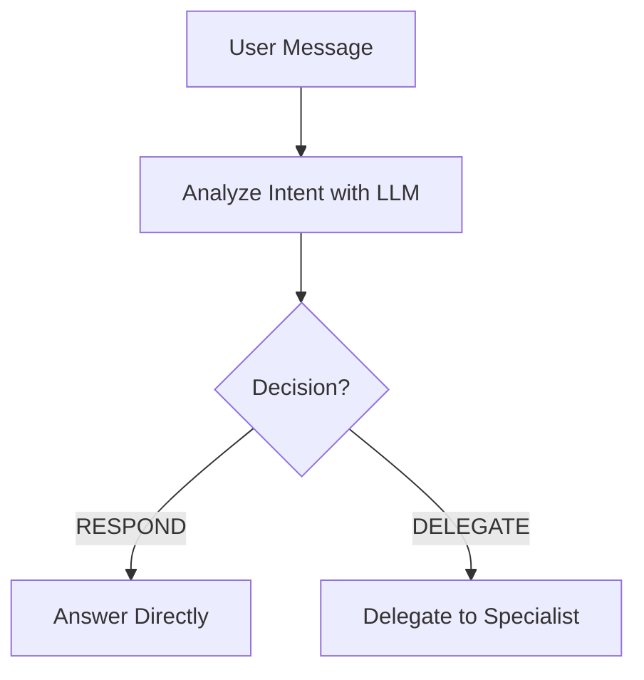

# VibeSDLC Agents Documentation

## 📋 Overview

VibeSDLC sử dụng **multi-agent system** với **Lean Kanban workflow** để quản lý và thực thi tasks trong software development lifecycle. Hệ thống gồm 4 agents chính làm việc theo mô hình **delegation-based routing**.

### Architecture Diagram

```
┌─────────────────────────────────────────────────────────────────┐
│                         USER                                    │
│              (Chat với agents qua UI)                           │
└───────────────────────┬─────────────────────────────────────────┘
                        │
                        ▼
┌─────────────────────────────────────────────────────────────────┐
│                   TEAM LEADER                                   │
│           (Routing Coordinator & Agile Coach)                   │
│                                                                 │
│  • Phân tích intent & Kanban context                           │
│  • Trò chuyện, tư vấn, giải thích concepts                     │
│  • Check WIP limits                                             │
│  • Route work đến specialist                                    │
└───────────────────────┬─────────────────────────────────────────┘
                        │
        ┌───────────────┼───────────────┐
        │               │               │
        ▼               ▼               ▼
┌──────────────┐ ┌──────────────┐ ┌──────────────┐
│   DEVELOPER  │ │ BUSINESS     │ │   TESTER     │
│              │ │ ANALYST      │ │              │
│ • Implement  │ │ • PRD/Stories│ │ • Test Plans │
│ • Code       │ │ • Requirements│ │ • QA         │
│ • Technical  │ │ • Analysis   │ │ • Validation │
└──────────────┘ └──────────────┘ └──────────────┘
```

### Core Principles

1. **Single Entry Point**: User chỉ chat với **Team Leader**
2. **Smart Routing**: Team Leader quyết định delegate hay respond
3. **Kanban-Aware**: Check WIP limits trước khi pull work
4. **Conversational**: Agents trò chuyện tự nhiên bằng tiếng Việt
5. **Specialist Delegation**: Technical work được route đến đúng specialist

---

## 🎯 Agents Overview

| Agent | Role | Primary Responsibility | Delegation Pattern |
|-------|------|----------------------|-------------------|
| **Team Leader** | Routing Coordinator & Coach | Route, tư vấn, giải thích | Entry point - delegates to others |
| **Developer** | Software Engineer | Implement features & code | Receives from Team Leader |
| **Business Analyst** | Requirements Specialist | PRD, user stories, analysis | Receives from Team Leader |
| **Tester** | QA Engineer | Test plans, testing, validation | Receives from Team Leader |

---

## 1️⃣ Team Leader

### Role
**"Team Leader & Agile Coach"**

### Goal
Guide teams through Kanban workflows, answer questions, and route work intelligently.

### Capabilities

#### 🗨️ Conversational
- Chào hỏi, cảm ơn, casual conversation
- Natural Vietnamese responses
- Friendly and approachable

#### 📚 Kanban Expert
- Explain WIP limits, flow efficiency, metrics
- Educate about cycle time, bottlenecks
- Provide Kanban best practices

#### 💡 Agile Coach
- Process optimization advice
- Best practices recommendations
- Ceremony guidance (standup, retro, etc.)

#### 🔄 Smart Router
- Analyze intent with LLM
- Check WIP capacity constraints
- Delegate technical work to specialists

### Workflow



**Note:** Kanban integration (WIP checks, board metrics) will be implemented in a future phase.

### When to RESPOND (Handle Directly)

| Intent Category | Examples | Response Type |
|----------------|----------|--------------|
| **CONVERSATIONAL** | "Chào bạn!", "Cảm ơn nhé" | Greeting, acknowledgment |
| **KANBAN_QUESTION** | "WIP là gì?", "Cycle time?" | Explain concepts |
| **STATUS_CHECK** | "Tiến độ thế nào?" | Report metrics |
| **PROCESS_ADVICE** | "Improve flow?" | Coaching tips |
| **EXPLAIN_CONSTRAINT** | "Tại sao chưa pull được?" | WIP explanation |

### When to DELEGATE

| Target Agent | Trigger | Condition |
|-------------|---------|-----------|
| **Developer** | "implement story #123" | InProgress has capacity |
| **Business Analyst** | "phân tích requirements" | Always |
| **Tester** | "tạo test plan" | Review has capacity |

### Example Interactions

#### Example 1: Conversational
```
User: "Chào Team Leader!"

Team Leader: "Chào bạn! Mình là Team Leader, sẵn sàng hỗ trợ bạn với 
Kanban board và project nhé! Bạn cần gì? 😊"

Action: RESPOND
```

#### Example 2: Kanban Question
```
User: "WIP limit là gì? Tại sao phải có?"

Team Leader: "WIP (Work In Progress) limit là giới hạn số công việc 
đồng thời ở mỗi cột. Ví dụ InProgress limit 5 nghĩa là chỉ làm tối đa 
5 stories cùng lúc. Lý do: (1) Tránh overcommitment, (2) Giảm context 
switching, (3) Finish work nhanh hơn. Hiện InProgress 3/5 - flow 
khá healthy!"

Action: RESPOND
```

#### Example 3: Status Check
```
User: "Tiến độ project thế nào?"

Team Leader: "Project đang tiến triển tốt! Đã hoàn thành 25 stories, 
đang có 3 stories InProgress và 2 stories đang Review. Flow ổn định, 
chưa có bottleneck đáng lo!"

Action: RESPOND with metrics
```

#### Example 4: Process Advice
```
User: "Làm sao để improve flow hiệu quả hơn?"

Team Leader: "Dựa vào board hiện tại, mình gợi ý: (1) Monitor cycle 
time - stories stuck lâu thì investigate, (2) Balance WIP - InProgress 
3/5 OK, (3) Daily focus vào blocked stories, (4) Visualize bottlenecks. 
Bạn muốn phân tích deeper không?"

Action: RESPOND with coaching
```

#### Example 5: Delegate (Has Capacity)
```
User: "implement story #123"
Board: InProgress 3/5

Team Leader: "Đã chuyển story #123 cho Developer! InProgress đang 3/5, 
còn 2 slots nên pull ngay được. Bạn sẽ được update khi Dev bắt đầu nhé!"

Action: DELEGATE to Developer
```

#### Example 6: WIP Full (Explain Constraint)
```
User: "implement story #123"
Board: InProgress 5/5 (FULL!)

Team Leader: "InProgress đang full (5/5), chưa thể pull story #123 ngay. 
Hãy đợi story chuyển sang Review để có slot trống nhé! Bạn muốn check 
story nào sắp xong không?"

Action: RESPOND (không delegate được)
```

### Technical Implementation

**Architecture:** CrewAI Flow-based with LLM routing

```python
# 2-step Flow (simplified)
1. analyze_and_route()  # LLM - decide DELEGATE/RESPOND
2. execute_decision()  # Python - route or respond
```

**Key Files:**
- `team_leader/team_leader.py` - Main agent class
- `team_leader/flow.py` - Flow implementation
- `team_leader/crew.py` - Agent & task definitions
- `team_leader/kanban_state.py` - Kanban state manager

**LLM:** OpenAI GPT-4o-mini

**Performance:**
- Latency: 3-5 seconds
- Cost: $0.02-0.04 per request
- LLM calls: 1 per request

---

## 2️⃣ Developer

### Role
**"Software Developer"**

### Goal
Implement software features and fixes according to specifications.

### Capabilities

- **Code Implementation**: Write production code for features
- **Technical Architecture**: Design system components
- **Bug Fixes**: Resolve technical issues
- **Code Review**: Review and improve code quality
- **Documentation**: Technical documentation

### When Called

**Trigger Patterns:**
- "implement story #123"
- "code feature X"
- "fix bug Y"
- "develop component Z"

**Prerequisite:**
- InProgress column has available capacity (WIP check passed)

### Workflow

```
1. Receives delegation from Team Leader
2. Reviews story/task requirements
3. Implements code
4. Runs tests & validation
5. Reports completion back to user
6. Updates story status → InProgress → Review
```

### Example Interaction

```
Team Leader → Developer: "Story #123 cần implement login feature"

Developer: 
"Nhận story #123 - Login feature! Mình sẽ:
1. Implement authentication endpoint
2. Add JWT token generation
3. Create login UI component
4. Write unit tests

Dự kiến hoàn thành trong 4-6 giờ. Mình sẽ update progress nhé! 💻"

[Developer implements code]

Developer → User:
"✅ Story #123 done! Login feature đã implement với:
- POST /api/auth/login endpoint
- JWT token với 24h expiry
- Login form với validation
- 12 unit tests passed

Story đã chuyển sang Review. Bạn có thể test thử nhé!"
```

### Technical Stack

- **Languages**: Python, JavaScript/TypeScript, etc.
- **Frameworks**: Configured per project
- **Tools**: Git, testing frameworks, linters

---

## 3️⃣ Business Analyst

### Role
**"Business Analyst / Requirements Specialist"**

### Goal
Analyze requirements, create PRD documents, and write user stories.

### Capabilities

- **Requirements Analysis**: Clarify and document requirements
- **PRD Creation**: Product Requirements Documents
- **User Story Writing**: Structured user stories with acceptance criteria
- **Stakeholder Interviews**: Gather requirements from users
- **Process Documentation**: Document workflows and processes

### When Called

**Trigger Patterns:**
- "phân tích requirements cho feature X"
- "tạo PRD cho module Y"
- "viết user stories"
- "cần document specs"

**No WIP check** (always available)

### Workflow

```
1. Receives delegation from Team Leader
2. Interviews user for requirements
3. Analyzes and documents requirements
4. Creates PRD or user stories
5. Reviews with stakeholders
6. Finalizes and delivers documentation
```

### Example Interaction

```
Team Leader → BA: "User cần phân tích requirements cho feature X"

Business Analyst:
"Nhận request phân tích feature X! Mình sẽ cần làm rõ vài điểm:

1. User personas nào sẽ dùng feature này?
2. Use cases chính là gì?
3. Integration với system hiện tại như thế nào?
4. Có constraints gì về performance/security không?

Bạn có thể share thêm context không? 📋"

[After analysis]

Business Analyst → User:
"✅ PRD cho feature X đã xong!

**Summary:**
- 3 user personas identified
- 5 core use cases documented
- 8 user stories với acceptance criteria
- Technical constraints & dependencies listed

PRD saved to: docs/prd-feature-x.md
Bạn review và feedback nhé!"
```

### Deliverables

- **PRD Documents**: Comprehensive requirements specs
- **User Stories**: Structured with "As a... I want... So that..."
- **Acceptance Criteria**: Clear success criteria
- **Flow Diagrams**: Visual workflow representations

---

## 4️⃣ Tester

### Role
**"QA Engineer / Tester"**

### Goal
Create comprehensive test plans and ensure software quality.

### Capabilities

- **Test Planning**: Create test strategies and plans
- **Test Case Writing**: Detailed test scenarios
- **Manual Testing**: Execute test cases
- **Automated Testing**: Write and run automated tests
- **Bug Reporting**: Document and track bugs
- **Quality Validation**: Verify acceptance criteria

### When Called

**Trigger Patterns:**
- "tạo test plan cho story #123"
- "test feature Y"
- "QA cho module Z"
- "cần validate requirements"

**Prerequisite:**
- Review column has available capacity (WIP check passed)

### Workflow

```
1. Receives delegation from Team Leader
2. Reviews story/feature requirements
3. Creates test plan & test cases
4. Executes tests (manual + automated)
5. Reports bugs (if any)
6. Validates acceptance criteria
7. Reports test results → Done or back to InProgress
```

### Example Interaction

```
Team Leader → Tester: "Story #123 cần test plan và QA"

Tester:
"Nhận story #123 - Login feature! Mình sẽ QA với:

**Test Plan:**
1. Functional Testing
   - Valid credentials → success
   - Invalid credentials → error message
   - Token generation & expiry
2. Security Testing
   - SQL injection protection
   - Password encryption
3. UI/UX Testing
   - Form validation
   - Error handling
   - Loading states

Bắt đầu testing nhé! 🧪"

[After testing]

Tester → User:
"✅ QA complete cho story #123!

**Test Results:**
- ✅ 18/18 test cases passed
- ✅ Security checks: No vulnerabilities
- ✅ Performance: Login < 200ms
- ✅ UX: All edge cases handled

Story #123 đã PASS QA, move to Done! 
Ready for production! 🎉"
```

### Testing Types

- **Functional Testing**: Feature behaviors
- **Integration Testing**: System interactions
- **Security Testing**: Vulnerabilities
- **Performance Testing**: Speed & load
- **UI/UX Testing**: User experience
- **Regression Testing**: No breaking changes

---

## 🔄 Delegation Flow

### Complete Flow Diagram

```
┌──────────────────────────────────────────────────────────────┐
│  USER: "implement story #123"                                │
└────────────────────┬─────────────────────────────────────────┘
                     │
                     ▼
┌──────────────────────────────────────────────────────────────┐
│  TEAM LEADER                                                 │
│  1. gather_context()                                         │
│     → Get board: InProgress 3/5, Review 2/3, Done 25        │
│  2. analyze_and_route()                                      │
│     → LLM: Intent = PULL_WORK, has capacity                 │
│     → Decision: DELEGATE to "developer"                      │
│  3. execute_decision()                                       │
│     → Send delegation event to Kafka                         │
└────────────────────┬─────────────────────────────────────────┘
                     │
                     │ [Kafka: DELEGATION_REQUESTS topic]
                     │
                     ▼
┌──────────────────────────────────────────────────────────────┐
│  DEVELOPER                                                   │
│  1. Receives task via Kafka consumer                        │
│  2. handle_task()                                            │
│     → Implement story #123                                   │
│     → Run tests                                              │
│  3. message_user()                                           │
│     → "✅ Story #123 done! Ready for review."               │
│  4. Update story status: Todo → InProgress → Review         │
└──────────────────────────────────────────────────────────────┘
                     │
                     │ [Kafka: AGENT_RESPONSES topic]
                     │
                     ▼
┌──────────────────────────────────────────────────────────────┐
│  USER receives message                                       │
└──────────────────────────────────────────────────────────────┘
```

### Kafka Topics

| Topic | Purpose | Publishers | Consumers |
|-------|---------|-----------|-----------|
| **AGENT_RESPONSES** | Agent → User messages | All agents | Frontend/Users |
| **DELEGATION_REQUESTS** | Team Leader → Specialists | Team Leader | Developer, BA, Tester |
| **AGENT_STATUS** | Agent state changes | All agents | Monitoring |

### Delegation API

**Team Leader delegates:**
```python
await self.delegate_to_role(
    task=task,
    target_role="developer",  # or "business_analyst", "tester"
    delegation_message="Vietnamese message"
)
```

**Specialist receives:**
```python
async def handle_task(self, task: TaskContext) -> TaskResult:
    # Implement work
    return TaskResult(
        success=True,
        output="Work completed!"
    )
```

---

## 📊 Kanban Integration

### WIP Limits

**Purpose:** Prevent overcommitment and maintain flow

**Limits:**
- **InProgress**: 5 stories (configurable)
- **Review**: 3 stories (configurable)

**Enforcement:**
- Team Leader checks WIP before delegating
- If FULL → RESPOND with explanation
- If available → DELEGATE to specialist

### Board Columns

```
Backlog → Todo → InProgress → Review → Done
            ↓         ↓          ↓
          (Pull)   (WIP 5)    (WIP 3)
```

### Flow Metrics

**Tracked Metrics:**
- **Cycle Time**: Time from start to done
- **Lead Time**: Time from request to done
- **Throughput**: Stories completed per week
- **WIP Utilization**: Current/Limit ratio

**Access:**
- Team Leader reports these in status checks
- Available via `/api/v1/projects/{id}/flow-metrics`

---

## 🛠️ Technical Architecture

### Base Agent Pattern

All agents inherit from `BaseAgent`:

```python
from app.agents.core.base_agent import BaseAgent, TaskContext, TaskResult

class MyAgent(BaseAgent):
    async def handle_task(self, task: TaskContext) -> TaskResult:
        # Implement agent logic
        return TaskResult(success=True, output="Done!")
```

### Key Base Agent Features

**Communication:**
```python
await self.message_user(message, message_type="text")
await self.delegate_to_role(task, target_role, delegation_message)
```

**Progress Tracking:**
```python
await self.update_progress(percentage=50, status_message="Working...")
```

**State Management:**
- Auto heartbeat to AgentPoolManager
- State transitions: idle → working → idle
- Execution statistics tracking

### Agent Pool Manager

**Responsibilities:**
- Spawn agents on-demand
- Monitor agent health (heartbeat)
- Track agent statistics
- Handle agent lifecycle

**Configuration:**
```python
heartbeat_interval = 30  # seconds
max_idle_time = 300  # seconds
```

### Kafka Event Flow

**1. User Message:**
```
Frontend → Kafka (USER_MESSAGES) → Router → Team Leader
```

**2. Team Leader Decision:**
```
Team Leader → analyze_and_route() → Decision (DELEGATE/RESPOND)
```

**3a. If DELEGATE:**
```
Team Leader → Kafka (DELEGATION_REQUESTS) → Specialist Agent
```

**3b. If RESPOND:**
```
Team Leader → Kafka (AGENT_RESPONSES) → Frontend → User
```

**4. Specialist Completes:**
```
Specialist → Kafka (AGENT_RESPONSES) → Frontend → User
```

---

## 📈 Performance & Monitoring

### Performance Metrics

| Agent | Avg Latency | LLM Calls | Cost/Request |
|-------|------------|-----------|--------------|
| **Team Leader** | 3-5s | 1 | $0.02-0.04 |
| **Developer** | 2-10min | 3-5 | $0.10-0.30 |
| **Business Analyst** | 1-5min | 2-4 | $0.08-0.20 |
| **Tester** | 1-3min | 2-3 | $0.06-0.15 |

### Monitoring

**Health Checks:**
- Agent heartbeat every 30s
- Kafka consumer lag monitoring
- Task execution success rate

**Alerts:**
- Agent down > 5min
- Task failure rate > 10%
- Kafka lag > 100 messages

**Dashboards:**
- Agent pool status
- Task throughput
- Response time trends
- Cost tracking

---

## 🎓 Best Practices

### For Users

1. **Start with Team Leader**: Always chat with Team Leader first
2. **Be Specific**: Clear requests → better routing
3. **Check Status**: Ask Team Leader về progress
4. **Understand WIP**: Respect capacity constraints

### For Agent Development

1. **Inherit BaseAgent**: Don't reimplement Kafka logic
2. **Handle Errors Gracefully**: Return `TaskResult` with error info
3. **Progress Updates**: Use `update_progress()` for long tasks
4. **Natural Language**: Vietnamese responses, conversational tone
5. **Test with WIP**: Always test with different WIP states

### For Team Leaders

1. **Monitor WIP**: Regularly check board utilization
2. **Balance Load**: Distribute work evenly
3. **Quick Responses**: Status checks should be fast
4. **Coach Users**: Explain Kanban concepts when needed

---

## 🔮 Future Enhancements

### Planned Features

- [ ] **Multi-Team Support**: Multiple concurrent projects
- [ ] **Agent Learning**: Improve routing based on history
- [ ] **Advanced Metrics**: Predictive flow analytics
- [ ] **Custom Agents**: User-defined specialist agents
- [ ] **Workflow Automation**: Auto-move stories based on rules

### Research Areas

- **Autonomous Agents**: Self-organizing work distribution
- **Flow Optimization**: ML-based WIP recommendations
- **Cross-Agent Collaboration**: Agents working together on complex tasks

---

## 📚 Additional Resources

**Code References:**
- `backend/app/agents/core/base_agent.py` - Base agent implementation
- `backend/app/agents/team_leader/` - Team Leader implementation
- `backend/app/kafka/` - Kafka infrastructure

**API Documentation:**
- `/api/v1/agents` - Agent management
- `/api/v1/projects/{id}/flow-metrics` - Kanban metrics

**Related Docs:**
- `README.md` - Project setup
- `ARCHITECTURE.md` - System architecture
- `API.md` - API reference

---

## ❓ FAQ

**Q: Tại sao user không chat trực tiếp với Developer?**
A: Team Leader làm routing layer để enforce WIP limits và maintain Kanban flow. Nếu chat trực tiếp, sẽ không có WIP control.

**Q: WIP limit có thể change không?**
A: Có, configure trong project settings. Recommended: InProgress 5, Review 3.

**Q: Nếu cả 3 specialists đều busy thì sao?**
A: Team Leader sẽ RESPOND giải thích capacity constraints và suggest đợi hoặc prioritize.

**Q: Agents có nhớ conversation history không?**
A: Có, qua TaskContext và project conversation history.

**Q: Cost optimization thế nào?**
A: Team Leader dùng GPT-4o-mini (cheap), specialists dùng model phù hợp với task complexity.

---

**Last Updated:** 2025-11-27  
**Version:** 1.0  
**Maintainer:** VibeSDLC Team
