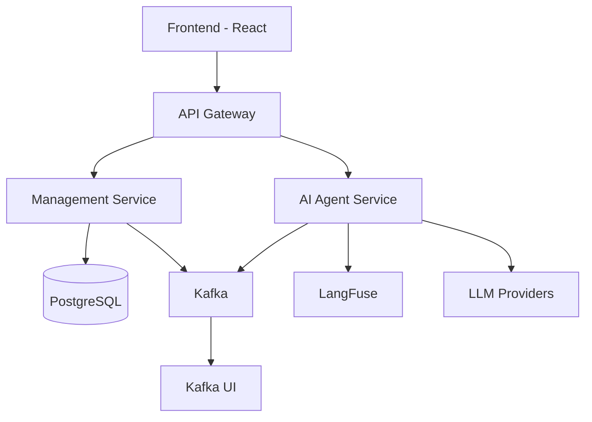

# VibeSDLC - Microservices Architecture

Dự án VibeSDLC đã được tách thành kiến trúc microservices với AI Agent integration.

## 🏗️ Architecture Overview



## 📁 Project Structure

```
VibeSDLC/
├── services/
│   ├── management-service/     # Task & User Management
│   └── ai-agent-service/       # AI Agent with LangChain
├── infrastructure/
│   ├── docker/                 # Infrastructure configs
│   └── kafka/                  # Kafka configuration
├── frontend/                   # React frontend
├── scripts/                    # Deployment scripts
├── docker-compose.yml          # Full stack deployment
└── .env.example               # Environment template
```

## 🔧 Services

### 1. Management Service (`services/management-service/`)
- **Port**: 8000
- **Framework**: FastAPI + SQLModel
- **Database**: PostgreSQL
- **Features**:
  - User authentication & management
  - Task/Item CRUD operations
  - Kafka event publishing
  - RESTful API

### 2. AI Agent Service (`services/ai-agent-service/`)
- **Port**: 8001
- **Framework**: FastAPI + LangChain + LangGraph
- **Features**:
  - AI-powered task analysis
  - Task prioritization & suggestions
  - Event-driven processing
  - LangFuse observability
  - Multi-LLM support (OpenAI, Anthropic)

### 3. Frontend (`frontend/`)
- **Port**: 5173
- **Framework**: React + TypeScript + Vite
- **Features**:
  - Multi-service API integration
  - Real-time updates
  - Modern UI with Chakra UI

## 🚀 Quick Start

### Prerequisites
- Docker & Docker Compose
- API Keys:
  - OpenAI API Key (optional)
  - Anthropic API Key (optional)
  - LangFuse Keys (optional)

### 1. Environment Setup
```bash
# Copy environment template
cp .env.example .env

# Edit .env file with your API keys
nano .env
```

### 2. Start All Services
```bash
# Start with script (recommended)
./scripts/start-microservices.sh

# Or manually with docker-compose
docker-compose up -d
```

### 3. Verify Services
```bash
# Check service health
curl http://localhost:8000/health  # Management Service
curl http://localhost:8001/health  # AI Agent Service

# Check frontend
open http://localhost:5173
```

## 🔌 Service Communication

### Event-Driven Architecture
Services communicate via Kafka events:

- **User Events**: `user-events` topic
  - `user.created`, `user.updated`, `user.deleted`

- **Item Events**: `item-events` topic
  - `item.created`, `item.updated`, `item.deleted`

### API Endpoints

#### Management Service (Port 8000)
```
GET    /api/v1/users/           # List users
POST   /api/v1/users/           # Create user
GET    /api/v1/items/           # List tasks
POST   /api/v1/items/           # Create task
PUT    /api/v1/items/{id}       # Update task
DELETE /api/v1/items/{id}       # Delete task
```

#### AI Agent Service (Port 8001)
```
POST   /api/v1/agents/analyze-task    # Analyze task with AI
GET    /api/v1/agents/health          # Service health
```

## 🤖 AI Agent Features

### LangGraph Workflow
1. **Task Analysis**: Analyze complexity and requirements
2. **Suggestion Generation**: Generate actionable recommendations
3. **Prioritization**: Determine task priority and next actions

### LangFuse Integration
- **Tracing**: Full conversation and workflow tracking
- **Observability**: Performance metrics and debugging
- **Analytics**: Usage patterns and insights

### Supported LLM Providers
- **OpenAI**: GPT-4, GPT-3.5
- **Anthropic**: Claude 3.5 Sonnet
- **Fallback**: Graceful degradation if APIs unavailable

## 📊 Monitoring & Observability

### Available Dashboards
- **Kafka UI**: http://localhost:8080
- **LangFuse**: https://cloud.langfuse.com (with your account)
- **Service Logs**: `docker-compose logs -f [service-name]`

### Health Checks
```bash
# Service health
docker-compose ps

# Individual service health
curl http://localhost:8000/health
curl http://localhost:8001/health
```

## 🔧 Development

### Local Development
```bash
# Start infrastructure only
docker-compose up -d postgres kafka zookeeper

# Run services locally
cd services/management-service && uv run uvicorn app.main:app --reload --port 8000
cd services/ai-agent-service && uv run uvicorn app.main:app --reload --port 8001
cd frontend && npm run dev
```

### Adding New Services
1. Create service directory under `services/`
2. Add service to `docker-compose.yml`
3. Update `scripts/start-microservices.sh`
4. Add Kafka topics if needed

## 🧪 Testing

### Unit Tests
```bash
# Management Service
cd services/management-service && uv run pytest

# AI Agent Service
cd services/ai-agent-service && uv run pytest
```

### Integration Tests
```bash
# End-to-end with all services
docker-compose -f docker-compose.test.yml up --abort-on-container-exit
```

## 🚢 Deployment

### Production Environment
```bash
# Set production environment
export ENVIRONMENT=production

# Deploy with production compose
docker-compose -f docker-compose.prod.yml up -d
```

### Scaling
```bash
# Scale specific services
docker-compose up -d --scale ai-agent-service=3
docker-compose up -d --scale management-service=2
```

## 🔒 Security

- JWT-based authentication
- Service-to-service communication via Kafka
- Environment variable management
- API key security best practices

## 📝 Environment Variables

### Required
```env
# Database
POSTGRES_USER=postgres
POSTGRES_PASSWORD=changethis
POSTGRES_DB=app

# Kafka
KAFKA_BOOTSTRAP_SERVERS=localhost:9092
```

### Optional (AI Features)
```env
# LLM Providers
OPENAI_API_KEY=your-key
ANTHROPIC_API_KEY=your-key

# LangFuse
LANGFUSE_SECRET_KEY=your-key
LANGFUSE_PUBLIC_KEY=your-key
LANGFUSE_HOST=https://cloud.langfuse.com
```

## 🆘 Troubleshooting

### Common Issues

1. **Kafka Connection Errors**
   ```bash
   # Restart Kafka services
   docker-compose restart zookeeper kafka
   ```

2. **Service Not Starting**
   ```bash
   # Check logs
   docker-compose logs [service-name]
   ```

3. **Database Connection Issues**
   ```bash
   # Reset database
   docker-compose down -v
   docker-compose up -d postgres
   ```

### Useful Commands
```bash
# View all services
docker-compose ps

# Follow logs
docker-compose logs -f

# Restart specific service
docker-compose restart management-service

# Clean up everything
docker-compose down -v --remove-orphans
```

## 🤝 Contributing

1. Fork the repository
2. Create feature branch
3. Make changes
4. Test with `docker-compose up`
5. Submit pull request

## 📄 License

MIT License - see LICENSE file for details