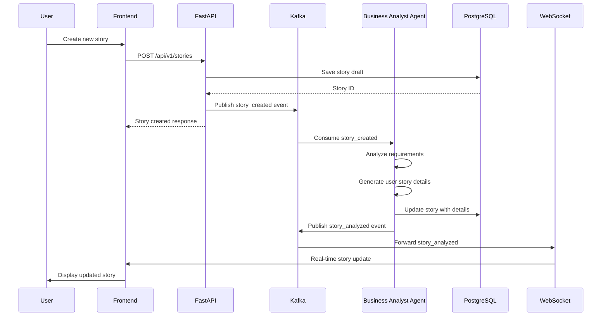
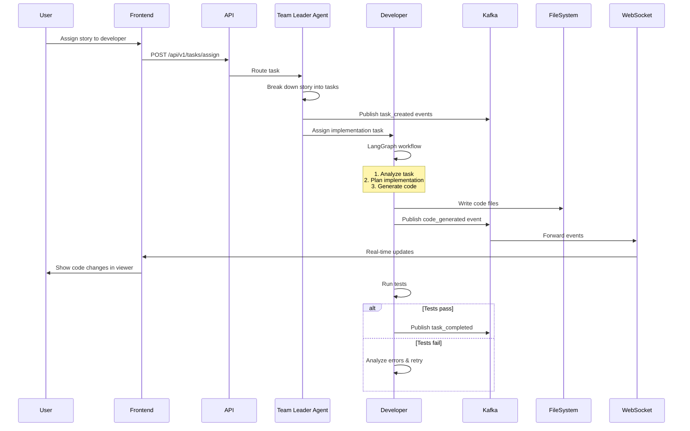
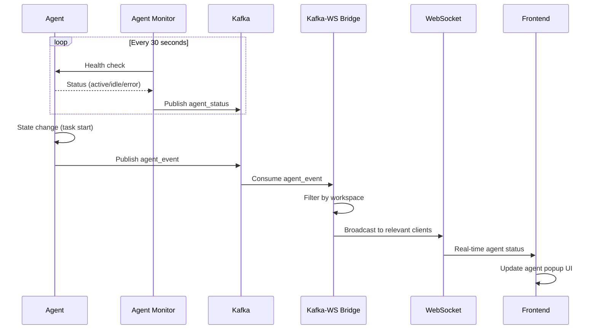
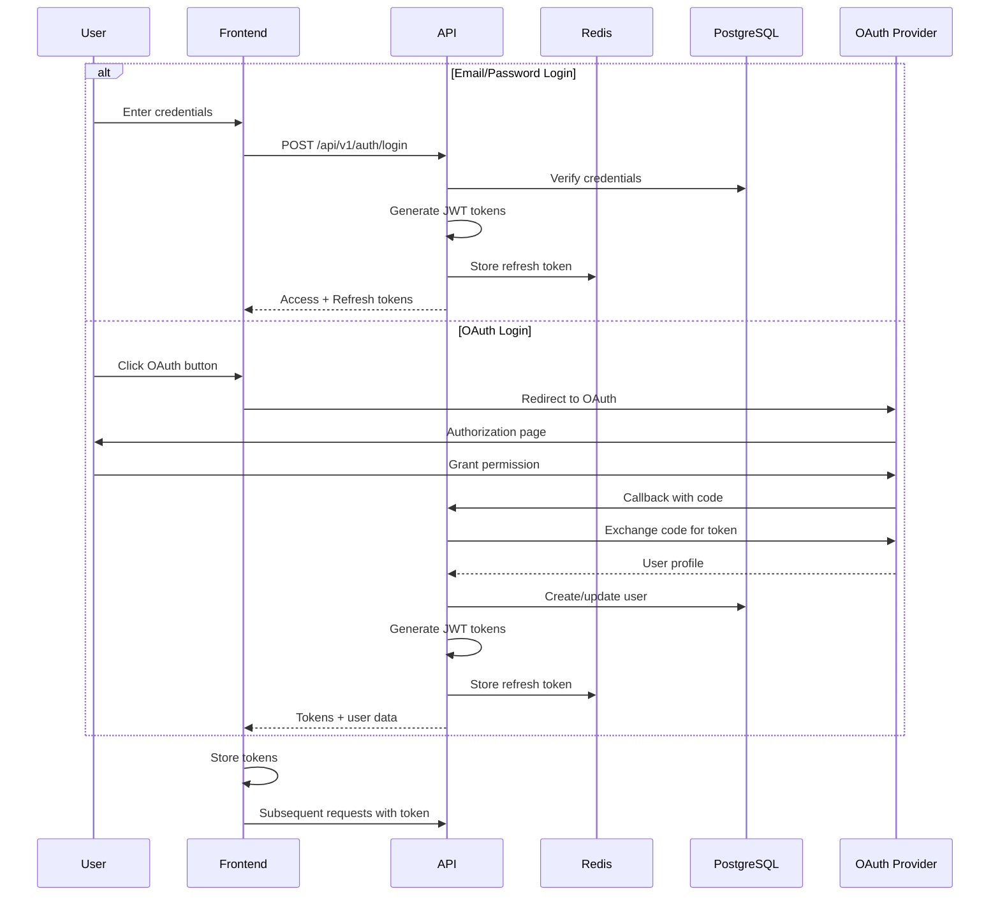
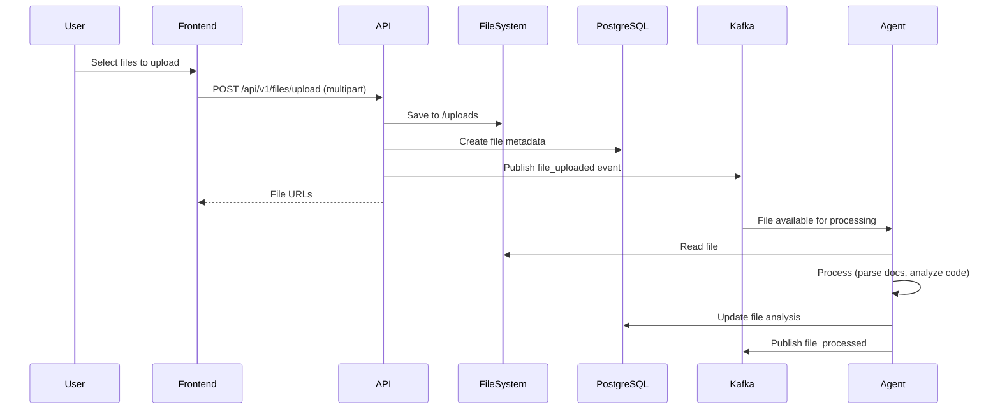

# System Architecture Documentation - VibeSDLC

## Mục lục
1. [Tổng quan hệ thống](#1-tổng-quan-hệ-thống)
2. [Kiến trúc tổng thể](#2-kiến-trúc-tổng-thể)
3. [Chi tiết các tầng kiến trúc](#3-chi-tiết-các-tầng-kiến-trúc)
4. [Luồng dữ liệu và Sequence Diagrams](#4-luồng-dữ-liệu-và-sequence-diagrams)
5. [Database Schema](#5-database-schema)
6. [API Architecture](#6-api-architecture)
7. [Security Architecture](#7-security-architecture)
8. [Deployment Architecture](#8-deployment-architecture)
9. [Technology Stack](#9-technology-stack)

---

## 1. Tổng quan hệ thống

### 1.1. Giới thiệu
**VibeSDLC** là một nền tảng quản lý vòng đời phát triển phần mềm (SDLC) được hỗ trợ bởi hệ thống AI Agents. Hệ thống tự động hóa các quy trình phát triển phần mềm thông qua việc sử dụng các AI agents chuyên biệt.

### 1.2. Đặc điểm chính
- **Multi-Agent AI System**: 4 loại agents (Team Leader, Business Analyst, Developer, Tester)
- **Event-Driven Architecture**: Sử dụng Apache Kafka cho real-time communication
- **Real-time Collaboration**: WebSocket cho cập nhật trực tiếp
- **Microservices Pattern**: Backend services độc lập và có thể mở rộng
- **Modern Tech Stack**: React 19, FastAPI, LangGraph, PostgreSQL

### 1.3. Mục tiêu kiến trúc
- **Scalability**: Có thể mở rộng theo chiều ngang với Agent Pool
- **Reliability**: Event-driven với message queue đảm bảo độ tin cậy
- **Real-time**: WebSocket và Kafka cho trải nghiệm real-time
- **Maintainability**: Clean Architecture với separation of concerns
- **Observability**: LangFuse integration cho monitoring và tracing

---

## 2. Kiến trúc tổng thể

### 2.1. High-Level Architecture Diagram

```
┌─────────────────────────────────────────────────────────────────────────┐
│                            CLIENT TIER                                   │
│  ┌──────────────────────────────────────────────────────────────────┐   │
│  │              React SPA (Vite + TypeScript)                       │   │
│  │  - TanStack Router/Query  - Zustand State Management            │   │
│  │  - WebSocket Client       - Radix UI + Tailwind CSS             │   │
│  └──────────────┬────────────────────────────────────┬──────────────┘   │
└─────────────────┼────────────────────────────────────┼──────────────────┘
                  │ HTTPS/WSS                          │ HTTPS
                  │                                    │
┌─────────────────▼────────────────────────────────────▼──────────────────┐
│                         APPLICATION TIER                                 │
│  ┌─────────────────────────────────────────────────────────────────┐    │
│  │                   FastAPI Application Server                    │    │
│  │  ┌───────────────────────────────────────────────────────────┐  │    │
│  │  │  API Layer (RESTful + WebSocket)                          │  │    │
│  │  │  - Authentication & Authorization (JWT, OAuth 2.0, 2FA)   │  │    │
│  │  │  - User Management (CRUD, Profile, Linked Accounts)       │  │    │
│  │  │  - Project Management (Projects, Workspaces, Tech Stacks) │  │    │
│  │  │  - SDLC Management (Stories, Tasks, Kanban)               │  │    │
│  │  │  - Chat & Messaging (Conversations, AI Interactions)      │  │    │
│  │  │  - File Management (Upload, Download, Artifacts)          │  │    │
│  │  │  - Agent Management (Pools, Monitoring, Control)          │  │    │
│  │  │  - Payment Integration (PayOS, SePay)                     │  │    │
│  │  └───────────────────────┬───────────────────────────────────┘  │    │
│  │                          │                                       │    │
│  │  ┌───────────────────────▼───────────────────────────────────┐  │    │
│  │  │  Business Logic Layer (Services)                          │  │    │
│  │  │  - ProjectService       - AuthService                     │  │    │
│  │  │  - StoryService         - ChatService                     │  │    │
│  │  │  - FileService          - PaymentService                  │  │    │
│  │  │  - AgentPoolManager     - WebSocketManager                │  │    │
│  │  └───────────────────────┬───────────────────────────────────┘  │    │
│  │                          │                                       │    │
│  │  ┌───────────────────────▼───────────────────────────────────┐  │    │
│  │  │  Data Access Layer (CRUD + ORM)                           │  │    │
│  │  │  - SQLModel ORM       - Alembic Migrations                │  │    │
│  │  │  - Async DB Operations                                    │  │    │
│  │  └───────────────────────────────────────────────────────────┘  │    │
│  └─────────────────────────────────────────────────────────────────┘    │
│                                                                           │
│  ┌─────────────────────────────────────────────────────────────────┐    │
│  │                WebSocket & Real-time Layer                      │    │
│  │  - Connection Manager    - Activity Buffer (Batching)          │    │
│  │  - Event Handlers (Task, Story, Flow, Agent Events)            │    │
│  │  - Kafka-WebSocket Bridge                                      │    │
│  └─────────────────────────────────────────────────────────────────┘    │
└──────────────────────────┬───────────────────────────────────────────────┘
                           │
┌──────────────────────────▼───────────────────────────────────────────────┐
│                     MESSAGE BROKER TIER                                   │
│  ┌─────────────────────────────────────────────────────────────────┐    │
│  │              Apache Kafka + Zookeeper Cluster                   │    │
│  │  ┌──────────────────┐  ┌──────────────────┐  ┌──────────────┐  │    │
│  │  │  Kafka Broker    │  │   Zookeeper      │  │  Kafka UI    │  │    │
│  │  │  Port: 9092      │  │   Port: 2181     │  │  Port: 8080  │  │    │
│  │  │  (29092 internal)│  │                  │  │              │  │    │
│  │  └──────────────────┘  └──────────────────┘  └──────────────┘  │    │
│  │                                                                  │    │
│  │  Topics:                                                         │    │
│  │  - agent_events          - task_updates                         │    │
│  │  - story_updates         - flow_events                          │    │
│  │  - chat_messages         - system_notifications                 │    │
│  └─────────────────────────────────────────────────────────────────┘    │
└──────────────────────────┬───────────────────────────────────────────────┘
                           │
┌──────────────────────────▼───────────────────────────────────────────────┐
│                       AI AGENTS TIER                                      │
│  ┌─────────────────────────────────────────────────────────────────┐    │
│  │                    Agent Infrastructure                          │    │
│  │  ┌──────────────────┐  ┌──────────────────┐  ┌──────────────┐  │    │
│  │  │  Message Router  │  │ Agent Pool Mgr   │  │Agent Monitor │  │    │
│  │  │  (Task Routing)  │  │ (Pool-based)     │  │(Health Check)│  │    │
│  │  └──────────────────┘  └──────────────────┘  └──────────────┘  │    │
│  └─────────────────────────────────────────────────────────────────┘    │
│                                                                           │
│  ┌─────────────────────────────────────────────────────────────────┐    │
│  │                    AI Agent Pools                                │    │
│  │  ┌───────────────┐ ┌─────────────────┐ ┌─────────────────────┐ │    │
│  │  │ Team Leader   │ │Business Analyst │ │    Developer        │ │    │
│  │  │     Pool      │ │      Pool       │ │       Pool          │ │    │
│  │  │               │ │                 │ │                     │ │    │
│  │  │ - Coordinate  │ │ - Requirements  │ │ - Code Generation   │ │    │
│  │  │ - Task Split  │ │ - User Stories  │ │ - Implementation    │ │    │
│  │  │ - Monitor     │ │ - Analysis      │ │ - Debugging         │ │    │
│  │  └───────────────┘ └─────────────────┘ └─────────────────────┘ │    │
│  │                                                                  │    │
│  │  ┌───────────────┐                                              │    │
│  │  │    Tester     │                                              │    │
│  │  │     Pool      │                                              │    │
│  │  │               │                                              │    │
│  │  │ - Test Plan   │                                              │    │
│  │  │ - Unit Tests  │                                              │    │
│  │  │ - Integration │                                              │    │
│  │  └───────────────┘                                              │    │
│  └─────────────────────────────────────────────────────────────────┘    │
│                                                                           │
│  ┌─────────────────────────────────────────────────────────────────┐    │
│  │              LangGraph Workflow Engine                           │    │
│  │  - State Machines      - Graph Execution                        │    │
│  │  - Node Processing     - Edge Routing                           │    │
│  │  - Checkpointing       - Error Handling                         │    │
│  └─────────────────────────────────────────────────────────────────┘    │
│                                                                           │
│  ┌─────────────────────────────────────────────────────────────────┐    │
│  │              LangChain Tools & Utilities                         │    │
│  │  - Filesystem Tools    - Workspace Tools                        │    │
│  │  - Code Analysis       - Testing Tools                          │    │
│  │  - Git Operations      - Document Parsing                       │    │
│  └─────────────────────────────────────────────────────────────────┘    │
└──────────────────────────┬───────────────────────────────────────────────┘
                           │
┌──────────────────────────▼───────────────────────────────────────────────┐
│                         DATA TIER                                         │
│  ┌──────────────────┐  ┌──────────────┐  ┌──────────────┐  ┌─────────┐ │
│  │   PostgreSQL     │  │    Redis     │  │   Qdrant     │  │  Files  │ │
│  │                  │  │              │  │   Vector DB  │  │ Storage │ │
│  │  - Users         │  │ - Sessions   │  │              │  │         │ │
│  │  - Projects      │  │ - Cache      │  │ - Embeddings │  │/uploads │ │
│  │  - Workspaces    │  │ - Tokens     │  │ - Semantic   │  │/avatars │ │
│  │  - Stories       │  │ - Rate Limit │  │   Search     │  │         │ │
│  │  - Tasks         │  │              │  │ - Knowledge  │  │         │ │
│  │  - Messages      │  │              │  │   Base       │  │         │ │
│  │  - Files         │  │              │  │              │  │         │ │
│  │  - Artifacts     │  │              │  │              │  │         │ │
│  │                  │  │              │  │              │  │         │ │
│  │  Port: 5432      │  │  Port: 6379  │  │  Port: 6333  │  │         │ │
│  └──────────────────┘  └──────────────┘  └──────────────┘  └─────────┘ │
└───────────────────────────────────────────────────────────────────────────┘

┌───────────────────────────────────────────────────────────────────────────┐
│                      EXTERNAL SERVICES TIER                                │
│  ┌──────────────┐ ┌──────────────┐ ┌──────────────┐ ┌──────────────┐    │
│  │  OpenAI API  │ │   LangFuse   │ │    Tavily    │ │    Sentry    │    │
│  │  (LiteLLM)   │ │  (Tracing &  │ │  (Web Search)│ │ (Error Track)│    │
│  │              │ │   Observ.)   │ │              │ │              │    │
│  └──────────────┘ └──────────────┘ └──────────────┘ └──────────────┘    │
│                                                                            │
│  ┌──────────────┐ ┌──────────────┐ ┌──────────────┐                     │
│  │ Gmail SMTP   │ │    PayOS     │ │    SePay     │                     │
│  │ (Email Send) │ │  (Payment)   │ │  (Payment)   │                     │
│  └──────────────┘ └──────────────┘ └──────────────┘                     │
│                                                                            │
│  ┌──────────────┐ ┌──────────────┐ ┌──────────────┐                     │
│  │Google OAuth  │ │GitHub OAuth  │ │Facebook OAuth│                     │
│  └──────────────┘ └──────────────┘ └──────────────┘                     │
└───────────────────────────────────────────────────────────────────────────┘
```

---

## 3. Chi tiết các tầng kiến trúc

### 3.1. Frontend Layer (Client Tier)

#### 3.1.1. Technology Stack
```javascript
{
  "framework": "React 19.1.1",
  "language": "TypeScript 5.9.2",
  "bundler": "Vite 7.1.7",
  "routing": "TanStack Router 1.132.6",
  "stateManagement": "Zustand 5.0.8",
  "dataFetching": "TanStack Query 5.90.2",
  "uiComponents": "Radix UI + Tailwind CSS 4.1.14",
  "realtime": "react-use-websocket 4.13.0"
}
```

#### 3.1.2. Key Components Architecture

```
src/
├── routes/                    # TanStack Router pages
│   ├── _authenticated/        # Protected routes
│   │   ├── chat.$chatId.tsx   # Chat interface
│   │   ├── projects/          # Project management
│   │   └── admin/             # Admin panel
│   └── auth/                  # Authentication pages
├── components/
│   ├── chat/                  # Chat components
│   │   ├── workspace-panel.tsx    # Main workspace
│   │   ├── kanban-board.tsx       # Kanban view
│   │   ├── app-viewer.tsx         # App preview
│   │   └── chat-interface.tsx     # Chat UI
│   ├── agents/                # Agent components
│   │   ├── agent-popup.tsx        # Agent details
│   │   └── agent-monitor.tsx      # Agent status
│   ├── shared/                # Shared components
│   │   ├── file-explorer.tsx      # File tree
│   │   └── code-viewer.tsx        # Monaco editor
│   └── ui/                    # Radix UI components
├── apis/                      # API clients
│   ├── auth.ts
│   ├── projects.ts
│   ├── chat.ts
│   └── files.ts
├── stores/                    # Zustand stores
│   ├── authStore.ts
│   ├── chatStore.ts
│   └── projectStore.ts
└── queries/                   # TanStack Query hooks
    ├── useAuth.ts
    ├── useProjects.ts
    └── useAgents.ts
```

#### 3.1.3. Real-time Communication
```typescript
// WebSocket connection for real-time updates
useWebSocket(`${WS_URL}/ws/chat/${chatId}`, {
  onMessage: (event) => {
    const data = JSON.parse(event.data);
    switch(data.type) {
      case 'agent_event':
        updateAgentStatus(data);
        break;
      case 'task_update':
        refreshKanban();
        break;
      case 'story_update':
        refreshStories();
        break;
    }
  }
});
```

### 3.2. Backend Layer (Application Tier)

#### 3.2.1. FastAPI Application Structure

```
app/
├── main.py                    # Application entry point
├── api/
│   ├── main.py               # API router aggregator
│   ├── deps.py               # Dependencies (auth, db)
│   └── routes/               # API endpoints
│       ├── auth.py           # Authentication endpoints
│       ├── oauth.py          # OAuth 2.0 flows
│       ├── users.py          # User management
│       ├── projects.py       # Project CRUD
│       ├── chat.py           # Chat & conversations
│       ├── messages.py       # Message handling
│       ├── stories.py        # User stories
│       ├── files.py          # File upload/download
│       ├── agents.py         # Agent interactions
│       ├── agent_management.py # Agent pool management
│       ├── lean_kanban.py    # Kanban board
│       ├── tech_stacks.py    # Technology stacks
│       ├── payments.py       # Payment integration
│       └── two_factor.py     # 2FA authentication
├── core/
│   ├── config.py             # Settings & configuration
│   ├── db.py                 # Database connection
│   ├── async_db.py           # Async DB operations
│   ├── redis_client.py       # Redis connection
│   └── logging_config.py     # Logging setup
├── models/                    # SQLModel ORM models
│   ├── user.py
│   ├── project.py
│   ├── story.py
│   ├── message.py
│   └── file.py
├── schemas/                   # Pydantic schemas
│   ├── user.py
│   ├── project.py
│   ├── story.py
│   └── message.py
├── crud/                      # Database operations
│   ├── user.py
│   ├── project.py
│   └── story.py
├── services/                  # Business logic
│   └── project_service.py
├── agents/                    # AI Agents system
│   ├── core/                 # Agent infrastructure
│   │   ├── base_agent.py     # Base agent class
│   │   ├── agent_pool_manager.py
│   │   ├── router.py         # Message router
│   │   ├── agent_monitor.py  # Health monitoring
│   │   └── task_registry.py
│   ├── team_leader/          # Team Leader agent
│   │   ├── team_leader.py
│   │   └── src/
│   ├── business_analyst/     # BA agent
│   │   ├── business_analyst.py
│   │   └── src/
│   ├── developer_v2/         # Developer agent
│   │   ├── developer_v2.py
│   │   └── src/
│   │       ├── graph.py      # LangGraph workflow
│   │       ├── state.py      # State definition
│   │       ├── nodes/        # Workflow nodes
│   │       ├── tools/        # LangChain tools
│   │       └── skills/       # Agent skills
│   └── tester/               # Tester agent
│       ├── tester.py
│       └── src/
├── websocket/                 # WebSocket handling
│   ├── connection_manager.py
│   ├── kafka_bridge.py       # Kafka-WS bridge
│   ├── activity_buffer.py    # Event batching
│   └── handlers/             # Event handlers
│       ├── task_handler.py
│       ├── story_handler.py
│       ├── flow_handler.py
│       └── agent_events_handler.py
├── kafka/                     # Kafka integration
│   ├── __init__.py           # Topic creation
│   ├── event_schemas.py      # Event definitions
│   └── consumer_registry.py  # Consumer management
└── utils/                     # Utilities
    ├── document_parser.py
    └── seed_personas.py
```

#### 3.2.2. API Architecture Patterns

**Clean Architecture Layers**:
```
Request → API Route → Service Layer → CRUD Layer → Database
         ↓
    Dependencies Injection (auth, db session)
```

**Example Flow**:
```python
# 1. API Route (app/api/routes/projects.py)
@router.post("/", response_model=ProjectPublic)
async def create_project(
    *,
    session: SessionDep,
    current_user: CurrentUser,
    project_in: ProjectCreate,
) -> ProjectPublic:
    project = await project_service.create_project(
        session, current_user, project_in
    )
    return project

# 2. Service Layer (app/services/project_service.py)
async def create_project(
    session: Session,
    user: User,
    project_in: ProjectCreate
) -> Project:
    # Business logic
    project = crud.project.create(session, project_in)
    await notify_agents(project)
    return project

# 3. CRUD Layer (app/crud/project.py)
def create(session: Session, obj_in: ProjectCreate) -> Project:
    db_obj = Project.model_validate(obj_in)
    session.add(db_obj)
    session.commit()
    session.refresh(db_obj)
    return db_obj
```

### 3.3. AI Agents Layer

#### 3.3.1. Agent Infrastructure Components

**1. Message Router** (`app/agents/core/router.py`)
```python
class MessageRouter:
    """Routes incoming tasks to appropriate agent pools"""
    
    async def route_task(self, task: Task) -> str:
        # Determine which agent type should handle the task
        if task.type == "requirement_analysis":
            return "business_analyst"
        elif task.type == "code_implementation":
            return "developer"
        elif task.type == "test_creation":
            return "tester"
        else:
            return "team_leader"
```

**2. Agent Pool Manager** (`app/agents/core/agent_pool_manager.py`)
```python
class AgentPoolManager:
    """Manages a pool of agent instances for scalability"""
    
    def __init__(self, agent_type: str, pool_size: int):
        self.agent_type = agent_type
        self.pool_size = pool_size
        self.agents: List[BaseAgent] = []
        self.task_queue = asyncio.Queue()
    
    async def start(self):
        # Initialize agent pool
        for _ in range(self.pool_size):
            agent = await self.create_agent()
            self.agents.append(agent)
        
        # Start workers
        self.workers = [
            asyncio.create_task(self.worker())
            for _ in range(self.pool_size)
        ]
    
    async def worker(self):
        while True:
            task = await self.task_queue.get()
            agent = await self.get_available_agent()
            await agent.process(task)
            self.task_queue.task_done()
```

**3. Agent Monitor** (`app/agents/core/agent_monitor.py`)
```python
class AgentMonitor:
    """Monitors agent health and performance"""
    
    async def monitor_loop(self):
        while self.running:
            for agent_id, agent in self.agents.items():
                health = await agent.health_check()
                await self.publish_status(agent_id, health)
            await asyncio.sleep(self.interval)
```

#### 3.3.2. LangGraph Workflow Architecture

**Developer Agent Workflow** (`app/agents/developer_v2/src/graph.py`):

```python
# State definition
class DeveloperState(TypedDict):
    messages: List[BaseMessage]
    task: Dict
    workspace_path: str
    implementation_plan: Optional[str]
    code_changes: List[Dict]
    errors: List[str]
    iteration: int

# Workflow nodes
def analyze_task(state: DeveloperState) -> DeveloperState:
    """Analyze the development task"""
    pass

def plan_implementation(state: DeveloperState) -> DeveloperState:
    """Create implementation plan"""
    pass

def implement_code(state: DeveloperState) -> DeveloperState:
    """Generate and write code"""
    pass

def run_tests(state: DeveloperState) -> DeveloperState:
    """Execute tests"""
    pass

def analyze_errors(state: DeveloperState) -> DeveloperState:
    """Analyze any errors"""
    pass

# Build workflow graph
workflow = StateGraph(DeveloperState)
workflow.add_node("analyze", analyze_task)
workflow.add_node("plan", plan_implementation)
workflow.add_node("implement", implement_code)
workflow.add_node("test", run_tests)
workflow.add_node("fix_errors", analyze_errors)

# Define edges
workflow.add_edge("analyze", "plan")
workflow.add_edge("plan", "implement")
workflow.add_edge("implement", "test")
workflow.add_conditional_edges(
    "test",
    lambda s: "fix_errors" if s["errors"] else END,
    {"fix_errors": "implement", END: END}
)

workflow.set_entry_point("analyze")
graph = workflow.compile()
```

**Workflow Execution Flow**:
```
START → analyze_task → plan_implementation → implement_code → run_tests
                                                    ↑              │
                                                    │              ▼
                                                    └──── analyze_errors (if errors)
                                                                   │
                                                                   ▼
                                                                  END
```

#### 3.3.3. LangChain Tools Integration

```python
# Filesystem tools (app/agents/developer_v2/src/tools/filesystem_tools.py)
@tool
def read_file(file_path: str) -> str:
    """Read file contents"""
    pass

@tool
def write_file(file_path: str, content: str) -> str:
    """Write content to file"""
    pass

@tool
def search_code(pattern: str, directory: str) -> List[Dict]:
    """Search for code patterns"""
    pass

# Workspace tools (app/agents/developer_v2/src/tools/workspace_tools.py)
@tool
def run_command(command: str, cwd: str) -> str:
    """Execute shell command"""
    pass

@tool
def install_package(package: str) -> str:
    """Install npm/pip package"""
    pass
```

### 3.4. Message Broker Layer (Kafka)

#### 3.4.1. Kafka Topics Structure

```yaml
Topics:
  - agent_events:
      partitions: 3
      replication_factor: 1
      purpose: "Agent status updates, task assignments"
      
  - task_updates:
      partitions: 3
      replication_factor: 1
      purpose: "Task status changes, progress updates"
      
  - story_updates:
      partitions: 3
      replication_factor: 1
      purpose: "User story modifications, new stories"
      
  - flow_events:
      partitions: 2
      replication_factor: 1
      purpose: "Workflow state changes"
      
  - chat_messages:
      partitions: 5
      replication_factor: 1
      purpose: "Chat messages, AI responses"
```

#### 3.4.2. Event Schema Definitions

```python
# app/kafka/event_schemas.py

class AgentEvent(BaseModel):
    event_type: Literal["status_update", "task_assigned", "task_completed"]
    agent_id: str
    agent_type: str
    timestamp: datetime
    data: Dict[str, Any]

class TaskUpdateEvent(BaseModel):
    event_type: Literal["created", "updated", "completed", "failed"]
    task_id: str
    story_id: str
    project_id: str
    status: str
    timestamp: datetime
    changes: Dict[str, Any]

class StoryUpdateEvent(BaseModel):
    event_type: Literal["created", "updated", "status_changed"]
    story_id: str
    project_id: str
    workspace_id: str
    timestamp: datetime
    data: Dict[str, Any]
```

#### 3.4.3. WebSocket-Kafka Bridge

```python
# app/websocket/kafka_bridge.py

class WebSocketKafkaBridge:
    """Bridge between Kafka events and WebSocket connections"""
    
    async def start(self):
        # Start Kafka consumers for each topic
        self.consumers = {
            'agent_events': await self.create_consumer('agent_events'),
            'task_updates': await self.create_consumer('task_updates'),
            'story_updates': await self.create_consumer('story_updates'),
        }
        
        # Start consumption loops
        for topic, consumer in self.consumers.items():
            asyncio.create_task(
                self.consume_and_broadcast(topic, consumer)
            )
    
    async def consume_and_broadcast(self, topic: str, consumer):
        """Consume Kafka messages and broadcast to WebSocket clients"""
        async for message in consumer:
            event_data = json.loads(message.value)
            
            # Determine which WebSocket clients should receive this
            target_clients = self.filter_clients(event_data)
            
            # Broadcast to relevant clients
            for client_id in target_clients:
                await self.ws_manager.send_to_client(
                    client_id, event_data
                )
```

### 3.5. Database Layer

#### 3.5.1. PostgreSQL Configuration

```python
# app/core/config.py
class Settings(BaseSettings):
    POSTGRES_SERVER: str
    POSTGRES_PORT: int = 5432
    POSTGRES_USER: str
    POSTGRES_PASSWORD: str
    POSTGRES_DB: str
    
    @computed_field
    @property
    def SQLALCHEMY_DATABASE_URI(self) -> PostgresDsn:
        return f"postgresql+psycopg://{self.POSTGRES_USER}:{self.POSTGRES_PASSWORD}@{self.POSTGRES_SERVER}:{self.POSTGRES_PORT}/{self.POSTGRES_DB}"
```

#### 3.5.2. Connection Pooling

```python
# app/core/db.py
from sqlmodel import create_engine
from psycopg_pool import AsyncConnectionPool

# Sync engine for migrations
engine = create_engine(
    str(settings.SQLALCHEMY_DATABASE_URI),
    pool_pre_ping=True,
    pool_size=20,
    max_overflow=40
)

# Async connection pool
async_pool = AsyncConnectionPool(
    conninfo=str(settings.SQLALCHEMY_DATABASE_URI),
    min_size=5,
    max_size=20
)
```

### 3.6. Cache & Session Layer (Redis)

```python
# app/core/redis_client.py
from redis import asyncio as aioredis

class RedisClient:
    def __init__(self):
        self.redis = None
    
    async def connect(self):
        self.redis = await aioredis.from_url(
            settings.REDIS_URL,
            encoding="utf-8",
            decode_responses=True
        )
    
    # Session management
    async def set_session(self, session_id: str, data: dict, ttl: int = 3600):
        await self.redis.setex(
            f"session:{session_id}",
            ttl,
            json.dumps(data)
        )
    
    # Token storage
    async def store_token(self, user_id: str, token: str, ttl: int):
        await self.redis.setex(f"token:{user_id}", ttl, token)
```

---

## 4. Luồng dữ liệu và Sequence Diagrams

### 4.1. User Story Creation Flow



**Detailed Steps**:

1. **User Input** (Frontend):
   ```typescript
   const createStory = async (data: StoryCreate) => {
     const response = await api.post('/stories', data);
     return response.data;
   };
   ```

2. **API Handler** (Backend):
   ```python
   @router.post("/stories")
   async def create_story(
       story_in: StoryCreate,
       session: SessionDep,
       current_user: CurrentUser
   ):
       # Save draft
       story = crud.story.create(session, story_in)
       
       # Publish to Kafka
       await kafka_producer.send(
           'story_updates',
           value=StoryUpdateEvent(
               event_type="created",
               story_id=story.id,
               data=story.model_dump()
           )
       )
       
       return story
   ```

3. **BA Agent Processing**:
   ```python
   async def process_story(self, story_data: dict):
       # LangGraph workflow
       result = await self.graph.ainvoke({
           "messages": [HumanMessage(content=story_data["description"])],
           "story_id": story_data["id"]
       })
       
       # Update story with AI analysis
       await self.update_story(story_data["id"], result)
   ```

4. **Real-time Update** (WebSocket):
   ```python
   # Kafka consumer forwards to WebSocket
   await ws_manager.broadcast_to_workspace(
       workspace_id,
       {
           "type": "story_update",
           "data": updated_story
       }
   )
   ```

### 4.2. Task Development Flow



### 4.3. Real-time Agent Monitoring Flow



### 4.4. Authentication Flow



### 4.5. File Upload & Processing Flow



---

## 5. Database Schema

### 5.1. Core Tables

#### Users Table
```sql
CREATE TABLE users (
    id UUID PRIMARY KEY DEFAULT gen_random_uuid(),
    email VARCHAR(255) UNIQUE NOT NULL,
    hashed_password VARCHAR(255),
    full_name VARCHAR(255),
    is_active BOOLEAN DEFAULT TRUE,
    is_superuser BOOLEAN DEFAULT FALSE,
    created_at TIMESTAMP DEFAULT CURRENT_TIMESTAMP,
    updated_at TIMESTAMP DEFAULT CURRENT_TIMESTAMP,
    
    -- OAuth fields
    oauth_provider VARCHAR(50),
    oauth_id VARCHAR(255),
    
    -- 2FA fields
    totp_secret VARCHAR(255),
    is_2fa_enabled BOOLEAN DEFAULT FALSE,
    
    -- Profile
    avatar_url VARCHAR(500),
    phone VARCHAR(20),
    bio TEXT
);

CREATE INDEX idx_users_email ON users(email);
CREATE INDEX idx_users_oauth ON users(oauth_provider, oauth_id);
```

#### Projects Table
```sql
CREATE TABLE projects (
    id UUID PRIMARY KEY DEFAULT gen_random_uuid(),
    name VARCHAR(255) NOT NULL,
    description TEXT,
    owner_id UUID REFERENCES users(id) ON DELETE CASCADE,
    tech_stack_id UUID REFERENCES tech_stacks(id),
    created_at TIMESTAMP DEFAULT CURRENT_TIMESTAMP,
    updated_at TIMESTAMP DEFAULT CURRENT_TIMESTAMP,
    is_active BOOLEAN DEFAULT TRUE,
    
    -- Git integration
    repository_url VARCHAR(500),
    branch VARCHAR(100),
    
    -- Project settings
    settings JSONB DEFAULT '{}'
);

CREATE INDEX idx_projects_owner ON projects(owner_id);
CREATE INDEX idx_projects_tech_stack ON projects(tech_stack_id);
```

#### Workspaces Table
```sql
CREATE TABLE workspaces (
    id UUID PRIMARY KEY DEFAULT gen_random_uuid(),
    name VARCHAR(255) NOT NULL,
    project_id UUID REFERENCES projects(id) ON DELETE CASCADE,
    created_by UUID REFERENCES users(id),
    created_at TIMESTAMP DEFAULT CURRENT_TIMESTAMP,
    
    -- Workspace configuration
    file_structure JSONB,
    environment_vars JSONB
);
```

#### Stories Table
```sql
CREATE TABLE stories (
    id UUID PRIMARY KEY DEFAULT gen_random_uuid(),
    title VARCHAR(500) NOT NULL,
    description TEXT,
    workspace_id UUID REFERENCES workspaces(id) ON DELETE CASCADE,
    project_id UUID REFERENCES projects(id) ON DELETE CASCADE,
    created_by UUID REFERENCES users(id),
    assigned_to UUID REFERENCES users(id),
    
    -- Story details
    story_type VARCHAR(50), -- feature, bug, task
    priority VARCHAR(20), -- low, medium, high, critical
    status VARCHAR(50), -- backlog, in_progress, review, done
    
    -- AI-generated fields
    acceptance_criteria JSONB,
    estimated_effort INTEGER, -- story points
    
    -- Timestamps
    created_at TIMESTAMP DEFAULT CURRENT_TIMESTAMP,
    updated_at TIMESTAMP DEFAULT CURRENT_TIMESTAMP,
    completed_at TIMESTAMP
);

CREATE INDEX idx_stories_workspace ON stories(workspace_id);
CREATE INDEX idx_stories_project ON stories(project_id);
CREATE INDEX idx_stories_status ON stories(status);
```

#### Tasks Table
```sql
CREATE TABLE tasks (
    id UUID PRIMARY KEY DEFAULT gen_random_uuid(),
    story_id UUID REFERENCES stories(id) ON DELETE CASCADE,
    title VARCHAR(500) NOT NULL,
    description TEXT,
    assigned_agent_type VARCHAR(50), -- developer, tester, etc.
    status VARCHAR(50), -- pending, in_progress, completed, failed
    
    -- Task details
    task_type VARCHAR(50),
    priority INTEGER,
    
    -- Execution tracking
    started_at TIMESTAMP,
    completed_at TIMESTAMP,
    error_message TEXT,
    
    -- Results
    output JSONB,
    artifacts JSONB, -- Generated files, test results, etc.
    
    created_at TIMESTAMP DEFAULT CURRENT_TIMESTAMP
);

CREATE INDEX idx_tasks_story ON tasks(story_id);
CREATE INDEX idx_tasks_status ON tasks(status);
```

#### Messages Table
```sql
CREATE TABLE messages (
    id UUID PRIMARY KEY DEFAULT gen_random_uuid(),
    chat_id UUID REFERENCES chats(id) ON DELETE CASCADE,
    sender_id UUID REFERENCES users(id),
    sender_type VARCHAR(20), -- user, agent
    agent_type VARCHAR(50), -- team_leader, developer, etc.
    
    -- Message content
    content TEXT NOT NULL,
    message_type VARCHAR(50), -- text, code, file, system
    metadata JSONB,
    
    -- Attachments
    attachments JSONB,
    
    -- Threading
    parent_message_id UUID REFERENCES messages(id),
    
    created_at TIMESTAMP DEFAULT CURRENT_TIMESTAMP,
    updated_at TIMESTAMP DEFAULT CURRENT_TIMESTAMP
);

CREATE INDEX idx_messages_chat ON messages(chat_id);
CREATE INDEX idx_messages_created ON messages(created_at DESC);
```

#### Files Table
```sql
CREATE TABLE files (
    id UUID PRIMARY KEY DEFAULT gen_random_uuid(),
    filename VARCHAR(500) NOT NULL,
    original_filename VARCHAR(500),
    file_path VARCHAR(1000) NOT NULL,
    file_size BIGINT,
    mime_type VARCHAR(100),
    
    -- Relationships
    project_id UUID REFERENCES projects(id) ON DELETE CASCADE,
    workspace_id UUID REFERENCES workspaces(id),
    uploaded_by UUID REFERENCES users(id),
    
    -- File metadata
    file_type VARCHAR(50), -- avatar, document, code, artifact
    is_public BOOLEAN DEFAULT FALSE,
    
    -- AI analysis
    analysis_result JSONB,
    
    created_at TIMESTAMP DEFAULT CURRENT_TIMESTAMP
);

CREATE INDEX idx_files_project ON files(project_id);
CREATE INDEX idx_files_workspace ON files(workspace_id);
```

#### Agents Table
```sql
CREATE TABLE agents (
    id UUID PRIMARY KEY DEFAULT gen_random_uuid(),
    agent_type VARCHAR(50) NOT NULL, -- team_leader, business_analyst, developer, tester
    human_name VARCHAR(255) NOT NULL,
    role_type VARCHAR(50),
    
    -- Agent configuration
    config JSONB,
    system_prompt TEXT,
    
    -- Persona
    avatar_url VARCHAR(500),
    description TEXT,
    skills JSONB,
    
    -- Status
    is_active BOOLEAN DEFAULT TRUE,
    created_at TIMESTAMP DEFAULT CURRENT_TIMESTAMP
);
```

### 5.2. Entity Relationship Diagram

```
┌─────────────┐         ┌──────────────┐         ┌─────────────┐
│    Users    │1      n │   Projects   │1      n │ Workspaces  │
│             ├─────────┤              ├─────────┤             │
│ - id        │ owns    │ - id         │ contains│ - id        │
│ - email     │         │ - name       │         │ - name      │
│ - password  │         │ - owner_id   │         │ - project_id│
└──────┬──────┘         └──────┬───────┘         └──────┬──────┘
       │                       │                        │
       │creates                │contains                │contains
       │                       │                        │
       │                ┌──────▼───────┐         ┌──────▼──────┐
       │                │   Stories    │1      n │    Tasks    │
       │                │              ├─────────┤             │
       │                │ - id         │         │ - id        │
       │                │ - title      │         │ - story_id  │
       │                │ - status     │         │ - status    │
       │                └──────────────┘         └─────────────┘
       │
       │sends
       │
┌──────▼──────┐         ┌──────────────┐
│  Messages   │         │     Chats    │
│             │n      1 │              │
│ - id        ├─────────┤ - id         │
│ - content   │ belongs │ - project_id │
│ - sender_id │         │              │
└─────────────┘         └──────────────┘

       ┌──────────────┐
       │    Files     │
       │              │
       │ - id         │
       │ - filename   │
       │ - project_id │
       │ - workspace_id
       └──────────────┘
```

---

## 6. API Architecture

### 6.1. API Endpoints Overview

#### Authentication & Users
```
POST   /api/v1/auth/login              # Email/password login
POST   /api/v1/auth/signup             # User registration
POST   /api/v1/auth/refresh            # Refresh access token
POST   /api/v1/auth/logout             # Logout
GET    /api/v1/auth/me                 # Get current user

# OAuth
GET    /api/v1/oauth/{provider}        # Initiate OAuth flow
GET    /api/v1/oauth-callback          # OAuth callback

# 2FA
POST   /api/v1/two-factor/setup        # Setup 2FA
POST   /api/v1/two-factor/verify       # Verify 2FA code
POST   /api/v1/two-factor/disable      # Disable 2FA

# Users
GET    /api/v1/users                   # List users (admin)
GET    /api/v1/users/{id}              # Get user
PATCH  /api/v1/users/{id}              # Update user
DELETE /api/v1/users/{id}              # Delete user
```

#### Projects & Workspaces
```
# Projects
GET    /api/v1/projects                # List projects
POST   /api/v1/projects                # Create project
GET    /api/v1/projects/{id}           # Get project
PATCH  /api/v1/projects/{id}           # Update project
DELETE /api/v1/projects/{id}           # Delete project

# Workspaces
GET    /api/v1/projects/{pid}/workspaces      # List workspaces
POST   /api/v1/projects/{pid}/workspaces      # Create workspace
GET    /api/v1/workspaces/{id}                # Get workspace
PATCH  /api/v1/workspaces/{id}                # Update workspace
```

#### Stories & Tasks
```
# Stories
GET    /api/v1/stories                 # List stories
POST   /api/v1/stories                 # Create story
GET    /api/v1/stories/{id}            # Get story
PATCH  /api/v1/stories/{id}            # Update story
DELETE /api/v1/stories/{id}            # Delete story

# Kanban
GET    /api/v1/lean-kanban/{workspace_id}     # Get Kanban board
PATCH  /api/v1/lean-kanban/{workspace_id}     # Update board

# Tasks
GET    /api/v1/stories/{id}/tasks      # List tasks
POST   /api/v1/tasks                   # Create task
GET    /api/v1/tasks/{id}              # Get task
PATCH  /api/v1/tasks/{id}              # Update task status
```

#### Chat & Messages
```
# Chats
GET    /api/v1/chats                   # List chats
POST   /api/v1/chats                   # Create chat
GET    /api/v1/chats/{id}              # Get chat
DELETE /api/v1/chats/{id}              # Delete chat

# Messages
GET    /api/v1/chats/{id}/messages     # List messages
POST   /api/v1/messages                # Send message
GET    /api/v1/messages/{id}           # Get message
PATCH  /api/v1/messages/{id}           # Edit message
DELETE /api/v1/messages/{id}           # Delete message

# WebSocket
WS     /api/v1/ws/chat/{chat_id}       # WebSocket connection
```

#### Files
```
POST   /api/v1/files/upload            # Upload files
GET    /api/v1/files/{id}              # Get file metadata
GET    /api/v1/files/{id}/download     # Download file
DELETE /api/v1/files/{id}              # Delete file
GET    /api/v1/files/project/{pid}     # List project files
```

#### Agents
```
# Agent Management
GET    /api/v1/agents                  # List available agents
GET    /api/v1/agents/{type}           # Get agent by type
POST   /api/v1/agents/pools            # Create agent pool
GET    /api/v1/agents/pools            # List pools
GET    /api/v1/agents/pools/{name}     # Get pool status
DELETE /api/v1/agents/pools/{name}     # Stop pool

# Agent Interaction
POST   /api/v1/agents/{type}/execute   # Execute agent task
GET    /api/v1/agents/{type}/status    # Get agent status
```

#### Tech Stacks
```
GET    /api/v1/tech-stacks             # List tech stacks
POST   /api/v1/tech-stacks             # Create tech stack
GET    /api/v1/tech-stacks/{id}        # Get tech stack
PATCH  /api/v1/tech-stacks/{id}        # Update tech stack
DELETE /api/v1/tech-stacks/{id}        # Delete tech stack
```

#### Payments
```
POST   /api/v1/payments/create         # Create payment
GET    /api/v1/payments/{id}           # Get payment status
POST   /api/v1/payments/webhook        # Payment webhook
```

### 6.2. API Request/Response Examples

#### Create Project
**Request**:
```http
POST /api/v1/projects
Content-Type: application/json
Authorization: Bearer <access_token>

{
  "name": "E-commerce Platform",
  "description": "Modern e-commerce solution",
  "tech_stack_id": "550e8400-e29b-41d4-a716-446655440000"
}
```

**Response**:
```json
{
  "id": "123e4567-e89b-12d3-a456-426614174000",
  "name": "E-commerce Platform",
  "description": "Modern e-commerce solution",
  "owner_id": "user-uuid",
  "tech_stack_id": "550e8400-e29b-41d4-a716-446655440000",
  "created_at": "2025-12-12T10:00:00Z",
  "updated_at": "2025-12-12T10:00:00Z",
  "is_active": true
}
```

#### Send Chat Message
**Request**:
```http
POST /api/v1/messages
Content-Type: application/json
Authorization: Bearer <access_token>

{
  "chat_id": "chat-uuid",
  "content": "Create a user authentication feature with email and password",
  "message_type": "text"
}
```

**Response**:
```json
{
  "id": "msg-uuid",
  "chat_id": "chat-uuid",
  "sender_id": "user-uuid",
  "sender_type": "user",
  "content": "Create a user authentication feature with email and password",
  "message_type": "text",
  "created_at": "2025-12-12T10:05:00Z"
}
```

**WebSocket Event** (Agent Response):
```json
{
  "type": "message",
  "data": {
    "id": "msg-uuid-2",
    "chat_id": "chat-uuid",
    "sender_type": "agent",
    "agent_type": "business_analyst",
    "content": "I'll help you create a user authentication feature. Let me analyze the requirements...",
    "created_at": "2025-12-12T10:05:02Z"
  }
}
```

---

## 7. Security Architecture

### 7.1. Authentication Mechanisms

#### JWT Token Structure
```python
# Access Token Payload
{
  "sub": "user-uuid",              # Subject (user ID)
  "email": "user@example.com",
  "exp": 1702392000,               # Expiration (8 days)
  "type": "access"
}

# Refresh Token Payload
{
  "sub": "user-uuid",
  "exp": 1702996800,               # Expiration (7 days)
  "type": "refresh"
}
```

#### Token Generation & Validation
```python
# app/core/security.py
from jose import jwt
from datetime import datetime, timedelta

def create_access_token(user_id: str) -> str:
    expire = datetime.utcnow() + timedelta(
        minutes=settings.ACCESS_TOKEN_EXPIRE_MINUTES
    )
    payload = {
        "sub": user_id,
        "exp": expire,
        "type": "access"
    }
    return jwt.encode(payload, settings.SECRET_KEY, algorithm="HS256")

def verify_token(token: str) -> dict:
    try:
        payload = jwt.decode(
            token,
            settings.SECRET_KEY,
            algorithms=["HS256"]
        )
        return payload
    except jwt.JWTError:
        raise HTTPException(401, "Invalid token")
```

### 7.2. OAuth 2.0 Flow

```python
# OAuth providers configuration
OAUTH_PROVIDERS = {
    "google": {
        "authorization_url": "https://accounts.google.com/o/oauth2/auth",
        "token_url": "https://oauth2.googleapis.com/token",
        "userinfo_url": "https://www.googleapis.com/oauth2/v2/userinfo",
        "scopes": ["openid", "email", "profile"]
    },
    "github": {
        "authorization_url": "https://github.com/login/oauth/authorize",
        "token_url": "https://github.com/login/oauth/access_token",
        "userinfo_url": "https://api.github.com/user",
        "scopes": ["user:email"]
    }
}
```

### 7.3. Two-Factor Authentication (2FA)

```python
# TOTP generation
import pyotp
import qrcode

def setup_2fa(user: User) -> dict:
    # Generate secret
    secret = pyotp.random_base32()
    
    # Create TOTP URI
    totp_uri = pyotp.totp.TOTP(secret).provisioning_uri(
        name=user.email,
        issuer_name="VibeSDLC"
    )
    
    # Generate QR code
    qr = qrcode.make(totp_uri)
    
    # Store secret (encrypted)
    user.totp_secret = encrypt(secret)
    
    return {
        "secret": secret,
        "qr_code": qr,
        "uri": totp_uri
    }

def verify_2fa_code(user: User, code: str) -> bool:
    secret = decrypt(user.totp_secret)
    totp = pyotp.TOTP(secret)
    return totp.verify(code)
```

### 7.4. Password Security

```python
from passlib.context import CryptContext

pwd_context = CryptContext(schemes=["bcrypt"], deprecated="auto")

def hash_password(password: str) -> str:
    return pwd_context.hash(password)

def verify_password(plain_password: str, hashed_password: str) -> bool:
    return pwd_context.verify(plain_password, hashed_password)
```

### 7.5. Rate Limiting

```python
from slowapi import Limiter
from slowapi.util import get_remote_address

limiter = Limiter(key_func=get_remote_address)

@app.post("/api/v1/auth/login")
@limiter.limit("5/minute")  # Max 5 login attempts per minute
async def login(request: Request):
    pass
```

### 7.6. CORS Configuration

```python
# Allowed origins from environment
BACKEND_CORS_ORIGINS = [
    "http://localhost:5173",    # Vite dev server
    "http://localhost:3000",    # Alternative frontend
    "https://app.vibesdlc.com"  # Production frontend
]

app.add_middleware(
    CORSMiddleware,
    allow_origins=BACKEND_CORS_ORIGINS,
    allow_credentials=True,
    allow_methods=["*"],
    allow_headers=["*"],
)
```

---

## 8. Deployment Architecture

### 8.1. Development Environment

```yaml
Development Stack:
  Frontend:
    - Node: 24.x
    - Package Manager: pnpm
    - Dev Server: Vite (port 5173)
    - Hot Reload: Enabled
    
  Backend:
    - Python: 3.11+
    - Package Manager: uv
    - ASGI Server: Uvicorn (port 8000)
    - Auto Reload: Enabled
    
  Databases:
    PostgreSQL:
      - Version: 15+
      - Port: 5432
      - Container: Docker
      
    Redis:
      - Version: 7+
      - Port: 6379
      - Container: Docker
      
  Message Broker:
    Kafka:
      - Version: 7.5.0
      - Ports: 9092 (external), 29092 (internal)
      - UI Port: 8080
      - Container: Docker Compose
```

### 8.2. Docker Compose Configuration

**Kafka Services** (`docker-compose.kafka.yml`):
```yaml
version: '3.8'

services:
  zookeeper:
    image: confluentinc/cp-zookeeper:7.5.0
    container_name: vibeSDLC-zookeeper
    environment:
      ZOOKEEPER_CLIENT_PORT: 2181
      ZOOKEEPER_TICK_TIME: 2000
    ports:
      - "2181:2181"
    volumes:
      - zookeeper_data:/var/lib/zookeeper/data
    networks:
      - vibeSDLC-network

  kafka:
    image: confluentinc/cp-kafka:7.5.0
    container_name: vibeSDLC-kafka
    depends_on:
      - zookeeper
    ports:
      - "9092:9092"
      - "9093:9093"
    environment:
      KAFKA_BROKER_ID: 1
      KAFKA_ZOOKEEPER_CONNECT: zookeeper:2181
      KAFKA_ADVERTISED_LISTENERS: PLAINTEXT://kafka:29092,PLAINTEXT_HOST://localhost:9092
      KAFKA_OFFSETS_TOPIC_REPLICATION_FACTOR: 1
      KAFKA_AUTO_CREATE_TOPICS_ENABLE: "true"
    volumes:
      - kafka_data:/var/lib/kafka/data
    networks:
      - vibeSDLC-network

  kafka-ui:
    image: provectuslabs/kafka-ui:latest
    container_name: vibeSDLC-kafka-ui
    depends_on:
      - kafka
    ports:
      - "8080:8080"
    environment:
      KAFKA_CLUSTERS_0_NAME: vibeSDLC
      KAFKA_CLUSTERS_0_BOOTSTRAPSERVERS: kafka:29092
    networks:
      - vibeSDLC-network

volumes:
  zookeeper_data:
  kafka_data:

networks:
  vibeSDLC-network:
    driver: bridge
```

### 8.3. Environment Configuration

**Backend** (`.env`):
```bash
# Application
PROJECT_NAME=VibeSDLC
ENVIRONMENT=local
DEBUG=true
API_V1_STR=/api/v1

# Security
SECRET_KEY=<generated-secret-key>
ACCESS_TOKEN_EXPIRE_MINUTES=11520  # 8 days

# Database
POSTGRES_SERVER=localhost
POSTGRES_PORT=5432
POSTGRES_USER=postgres
POSTGRES_PASSWORD=<secure-password>
POSTGRES_DB=vibesdlc_data

# Redis
REDIS_URL=redis://localhost:6379

# Kafka
KAFKA_BOOTSTRAP_SERVERS=localhost:9092

# CORS
FRONTEND_HOST=http://localhost:5173
BACKEND_HOST=http://localhost:8000
BACKEND_CORS_ORIGINS=http://localhost:3000,http://localhost:5173

# OAuth
GOOGLE_CLIENT_ID=<google-client-id>
GOOGLE_CLIENT_SECRET=<google-client-secret>
GITHUB_CLIENT_ID=<github-client-id>
GITHUB_CLIENT_SECRET=<github-client-secret>

# AI Services
OPENAI_API_KEY=<openai-api-key>
LANGFUSE_HOST=https://langfuse.vibesdlc.com
LANGFUSE_PUBLIC_KEY=<public-key>
LANGFUSE_SECRET_KEY=<secret-key>

# Email
SMTP_HOST=smtp.gmail.com
SMTP_PORT=587
SMTP_USER=<email>
SMTP_PASSWORD=<app-password>
EMAILS_FROM_EMAIL=<from-email>
```

**Frontend** (`.env`):
```bash
VITE_API_URL=http://localhost:8000/api/v1
VITE_WS_URL=ws://localhost:8000/api/v1
```

### 8.4. Production Deployment Considerations

```yaml
Production Architecture:
  Load Balancer:
    - Nginx/Traefik
    - SSL/TLS termination
    - Rate limiting
    
  Application Servers:
    - Multiple FastAPI instances
    - Horizontal scaling with container orchestration
    - Health checks
    
  Database:
    - PostgreSQL cluster (primary + replicas)
    - Connection pooling (PgBouncer)
    - Automated backups
    
  Caching:
    - Redis Cluster
    - Sentinel for high availability
    
  Message Broker:
    - Kafka cluster (3+ brokers)
    - Replication factor: 3
    - Topic partitioning strategy
    
  Monitoring:
    - Sentry (error tracking)
    - LangFuse (AI observability)
    - Prometheus + Grafana (metrics)
    - ELK Stack (logging)
    
  Container Orchestration:
    - Kubernetes / Docker Swarm
    - Auto-scaling policies
    - Rolling updates
```

---

## 9. Technology Stack

### 9.1. Frontend Technologies

| Category | Technology | Version | Purpose |
|----------|-----------|---------|---------|
| **Framework** | React | 19.1.1 | UI library |
| **Language** | TypeScript | 5.9.2 | Type safety |
| **Build Tool** | Vite | 7.1.7 | Fast development & building |
| **Routing** | TanStack Router | 1.132.6 | Type-safe routing |
| **State Management** | Zustand | 5.0.8 | Lightweight state |
| **Data Fetching** | TanStack Query | 5.90.2 | Server state management |
| **UI Components** | Radix UI | Latest | Accessible components |
| **Styling** | Tailwind CSS | 4.1.14 | Utility-first CSS |
| **Forms** | React Hook Form | 7.63.0 | Form handling |
| **Validation** | Zod | 4.1.11 | Schema validation |
| **WebSocket** | react-use-websocket | 4.13.0 | Real-time communication |
| **HTTP Client** | Axios | 1.12.2 | API requests |
| **Code Editor** | Monaco Editor | 4.7.0 | Code viewing/editing |
| **Markdown** | React Markdown | 10.1.0 | Markdown rendering |
| **Animations** | Framer Motion | 12.23.22 | UI animations |
| **Icons** | Lucide React | 0.544.0 | Icon library |
| **Testing** | Playwright | 1.55.1 | E2E testing |

### 9.2. Backend Technologies

| Category | Technology | Version | Purpose |
|----------|-----------|---------|---------|
| **Framework** | FastAPI | 0.115.0+ | Web framework |
| **Language** | Python | 3.11+ | Programming language |
| **ASGI Server** | Uvicorn | 0.34.0+ | ASGI server |
| **ORM** | SQLModel | 0.0.27+ | SQL ORM with Pydantic |
| **Migrations** | Alembic | 1.17.0+ | Database migrations |
| **Database Driver** | psycopg | 3.2.12+ | PostgreSQL driver |
| **Cache Client** | Redis | 7.0.1+ | Redis client |
| **Validation** | Pydantic | 2.10.0+ | Data validation |
| **Auth** | PyJWT | 2.8.0+ | JWT handling |
| **Password Hashing** | Passlib + Bcrypt | 1.7.4 / 4.0.1 | Password security |
| **2FA** | pyotp | 2.9.0+ | TOTP authentication |
| **Rate Limiting** | SlowAPI | 0.1.9+ | API rate limiting |
| **Email** | emails | 0.6.0+ | Email sending |
| **HTTP Client** | httpx | 0.28.0+ | Async HTTP client |
| **Error Tracking** | Sentry SDK | 2.0.0+ | Error monitoring |

### 9.3. AI & ML Technologies

| Category | Technology | Version | Purpose |
|----------|-----------|---------|---------|
| **Workflow Engine** | LangGraph | 1.0.4+ | Agent workflows |
| **LLM Framework** | LangChain | 1.1.0+ | LLM orchestration |
| **LLM Core** | LangChain Core | 1.1.0+ | Core abstractions |
| **LLM Gateway** | LiteLLM | 1.80.0+ | Multi-provider LLM |
| **OpenAI** | LangChain OpenAI | 0.3.0+ | OpenAI integration |
| **Anthropic** | LangChain Anthropic | 1.2.0+ | Claude integration |
| **Web Search** | Tavily Python | 0.7.13+ | AI web search |
| **Observability** | LangFuse | 3.10.1+ | LLM tracing |
| **Vector DB** | Qdrant Client | 1.15.1+ | Vector storage |
| **Checkpointing** | LangGraph Checkpoint | 3.0.2+ | Workflow persistence |

### 9.4. Infrastructure Technologies

| Category | Technology | Version | Purpose |
|----------|-----------|---------|---------|
| **Database** | PostgreSQL | 15+ | Primary database |
| **Cache** | Redis | 7+ | Caching & sessions |
| **Vector DB** | Qdrant | Latest | Embeddings storage |
| **Message Broker** | Apache Kafka | 7.5.0 | Event streaming |
| **Coordination** | Zookeeper | 7.5.0 | Kafka coordination |
| **Containerization** | Docker | Latest | Container runtime |
| **Orchestration** | Docker Compose | Latest | Multi-container apps |

### 9.5. Development Tools

| Category | Technology | Purpose |
|----------|-----------|---------|
| **Package Manager (Python)** | uv | Fast Python package management |
| **Package Manager (Node)** | pnpm | Efficient Node package management |
| **Linter (Python)** | Ruff | Fast Python linter |
| **Linter (JS/TS)** | Biome | Fast JS/TS linter |
| **Type Checker** | TypeScript / mypy | Static type checking |
| **Git** | Git 2.43+ | Version control |
| **API Client** | OpenAPI Generator | API client generation |

---

## 10. Appendix

### 10.1. Glossary

- **Agent Pool**: A collection of agent instances managed for parallel task processing
- **LangGraph**: Framework for building stateful, multi-agent workflows
- **LangChain**: Framework for developing LLM-powered applications
- **Message Router**: Component that routes tasks to appropriate agent pools
- **Kafka Topic**: Named stream of records in Kafka
- **WebSocket Bridge**: Component connecting Kafka events to WebSocket clients
- **Story**: User story or requirement in Agile methodology
- **Task**: Unit of work assigned to an agent
- **Workspace**: Isolated environment for a project

### 10.2. References

- FastAPI Documentation: https://fastapi.tiangolo.com/
- LangGraph Documentation: https://langchain-ai.github.io/langgraph/
- Apache Kafka Documentation: https://kafka.apache.org/documentation/
- React Documentation: https://react.dev/
- TanStack Router: https://tanstack.com/router/latest
- Radix UI: https://www.radix-ui.com/

---

**Document Version**: 1.0  
**Last Updated**: 2025-12-12  
**Maintained By**: VibeSDLC Team
