# Developer Agent Workflow - 10 Sub-Agents

## Mermaid Workflow Diagram

```mermaid
graph TD
    A[Scrum Master assigns task] --> B[Task Analyzer]
    
    %% Task Analysis Phase
    B --> B1[Parse requirements]
    B --> B2[Identify dependencies]
    B --> B3[Estimate complexity]
    B --> B4[Create implementation plan]
    B1 --> C[Code Implementer]
    B2 --> C
    B3 --> C
    B4 --> C
    
    %% Code Implementation Phase
    C --> C1[Generate main code]
    C --> C2[Apply design patterns]
    C --> C3[Handle error scenarios]
    C --> C4[Optimize code performance]
    C1 --> D[Test Generator]
    C2 --> D
    C3 --> D
    C4 --> D
    
    %% Test Generation Phase
    D --> D1[Generate unit tests]
    D --> D2[Create integration tests]
    D --> D3[Generate mocks]
    D --> D4[Analyze coverage]
    D1 --> E[Code Reviewer]
    D2 --> E
    D3 --> E
    D4 --> E
    
    %% Code Review Phase
    E --> E1[Review logic & architecture]
    E --> E2[Security analysis]
    E --> E3[Performance analysis]
    E --> E4[Generate feedback]
    E1 --> F{Quality Gates}
    E2 --> F
    E3 --> F
    E4 --> F
    
    %% Quality Gates Decision
    F -->|Pass| G[Quality Assurer]
    F -->|Fail| C
    
    %% Quality Assurance Phase
    G --> G1[Run linting]
    G --> G2[Security scan]
    G --> G3[Standards check]
    G --> G4[Generate quality report]
    G1 --> H{Quality Check}
    G2 --> H
    G3 --> H
    G4 --> H
    
    %% Quality Check Decision
    H -->|Pass| I[Refactoring Agent]
    H -->|Fail| C
    
    %% Refactoring Phase
    I --> I1[Detect code smells]
    I --> I2[Analyze technical debt]
    I --> I3[Suggest improvements]
    I --> I4[Plan refactoring]
    I1 --> J{Dependency Manager}
    I2 --> J
    I3 --> J
    I4 --> J
    
    %% Dependency Management Phase
    J --> J1[Check vulnerabilities]
    J --> J2[Resolve conflicts]
    J --> J3[Suggest updates]
    J --> J4[Monitor health]
    J1 --> K[Performance Optimizer]
    J2 --> K
    J3 --> K
    J4 --> K
    
    %% Performance Optimization Phase
    K --> K1[Profile execution]
    K --> K2[Identify bottlenecks]
    K --> K3[Optimize caching]
    K --> K4[Analyze complexity]
    K1 --> L[Documentation Generator]
    K2 --> L
    K3 --> L
    K4 --> L
    
    %% Documentation Generation Phase
    L --> L1[Generate API docs]
    L --> L2[Create user guide]
    L --> L3[Add code comments]
    L --> L4[Generate examples]
    L1 --> M[Integration Manager]
    L2 --> M
    L3 --> M
    L4 --> M
    
    %% Integration Management Phase
    M --> M1[Create PR]
    M --> M2[Handle review feedback]
    M --> M3[Manage deployment]
    M --> M4[Coordinate CI/CD]
    M1 --> N{Deployment Success?}
    M2 --> N
    M3 --> N
    M4 --> N
    
    %% Final Decision
    N -->|Success| O[Task Completed ✅]
    N -->|Failed| P[Rollback & Retry]
    P --> M
    
    %% Feedback Loops
    E -->|Critical Issues| B
    F -->|Major Issues| B
    
    %% Styling
    classDef startEnd fill:#e1f5fe
    classDef analyzer fill:#f3e5f5
    classDef implementer fill:#e8f5e8
    classDef reviewer fill:#fff3e0
    classDef quality fill:#fce4ec
    classDef decision fill:#f1f8e9
    
    class A,O startEnd
    class B,B1,B2,B3,B4 analyzer
    class C,C1,C2,C3,C4 implementer
    class E,E1,E2,E3,E4 reviewer
    class G,G1,G2,G3,G4 quality
    class F,H,N decision
```

## Workflow Description

### Phase 1: Task Analysis (Task Analyzer)
1. **Parse requirements** - Extract functional and non-functional requirements
2. **Identify dependencies** - Map dependencies between tasks and external systems
3. **Estimate complexity** - Calculate complexity score based on requirements
4. **Create implementation plan** - Break down task into manageable steps

### Phase 2: Code Implementation (Code Implementer)
1. **Generate main code** - Create production-ready code following requirements
2. **Apply design patterns** - Implement appropriate design patterns
3. **Handle error scenarios** - Add comprehensive error handling
4. **Optimize code performance** - Optimize for performance and efficiency

### Phase 3: Test Generation (Test Generator)
1. **Generate unit tests** - Create comprehensive unit test suite
2. **Create integration tests** - Build integration test scenarios
3. **Generate mocks** - Create mocks for external dependencies
4. **Analyze coverage** - Ensure high test coverage

### Phase 4: Code Review (Code Reviewer)
1. **Review logic & architecture** - Analyze business logic and design decisions
2. **Security analysis** - Perform security-focused code review
3. **Performance analysis** - Identify performance implications
4. **Generate feedback** - Create actionable feedback for improvements

### Phase 5: Quality Gates (Quality Assurer)
1. **Run linting** - Execute code style and quality checks
2. **Security scan** - Perform automated security vulnerability scans
3. **Standards check** - Validate coding standards compliance
4. **Generate quality report** - Create comprehensive quality assessment

### Phase 6: Refactoring (Refactoring Agent)
1. **Detect code smells** - Identify anti-patterns and code smells
2. **Analyze technical debt** - Track and prioritize technical debt
3. **Suggest improvements** - Recommend refactoring opportunities
4. **Plan refactoring** - Create refactoring roadmap

### Phase 7: Dependency Management (Dependency Manager)
1. **Check vulnerabilities** - Scan for security vulnerabilities in dependencies
2. **Resolve conflicts** - Handle version conflicts between dependencies
3. **Suggest updates** - Recommend dependency updates
4. **Monitor health** - Track dependency health and maintenance

### Phase 8: Performance Optimization (Performance Optimizer)
1. **Profile execution** - Analyze code execution performance
2. **Identify bottlenecks** - Find performance bottlenecks
3. **Optimize caching** - Implement and optimize caching strategies
4. **Analyze complexity** - Evaluate algorithm complexity

### Phase 9: Documentation (Documentation Generator)
1. **Generate API docs** - Create comprehensive API documentation
2. **Create user guide** - Build user-friendly guides
3. **Add code comments** - Enhance code with meaningful comments
4. **Generate examples** - Create usage examples and tutorials

### Phase 10: Integration (Integration Manager)
1. **Create PR** - Generate pull request with all changes
2. **Handle review feedback** - Process and address review comments
3. **Manage deployment** - Coordinate deployment to target environments
4. **Coordinate CI/CD** - Integrate with continuous integration pipelines

## Key Features

### 🔄 **Feedback Loops**
- **Critical Issues**: Code Reviewer can send tasks back to Task Analyzer
- **Quality Failures**: Failed quality gates return to Code Implementer
- **Deployment Failures**: Failed deployments trigger rollback and retry

### ⚡ **Parallel Processing**
- Multiple sub-agents can work simultaneously on different aspects
- Optimized for speed and efficiency

### 🛡️ **Quality Assurance**
- Multiple quality gates ensure high code quality
- Comprehensive testing and review processes
- Security and performance validation

### 🔧 **Error Recovery**
- Automatic retry mechanisms
- Rollback capabilities
- Graceful failure handling

### 📊 **Monitoring & Metrics**
- Real-time progress tracking
- Quality metrics collection
- Performance monitoring

## Configuration Options

Each sub-agent can be configured independently:
- Enable/disable specific phases
- Adjust quality thresholds
- Customize review criteria
- Set performance targets

## Integration Points

- **Scrum Master**: Receives tasks and sends status updates
- **Product Owner**: Coordinates on requirements and acceptance criteria
- **Tester Agent**: Validates generated test cases
- **Management Service**: Handles project configurations and permissions
