# Developer Agent - Simplified Workflow

## Linear Workflow Diagram

```mermaid
graph LR
    A[Scrum Master] --> B[Task Analyzer]
    B --> C[Code Implementer]
    C --> D[Test Generator]
    D --> E[Code Reviewer]
    E --> F[Quality Assurer]
    F --> G[Refactoring Agent]
    G --> H[Dependency Manager]
    H --> I[Performance Optimizer]
    I --> J[Documentation Generator]
    J --> K[Integration Manager]
    K --> L[✅ Task Complete]
    
    %% Feedback loops
    E -.->|Critical Issues| B
    F -.->|Quality Fail| C
    K -.->|Deploy Fail| I
    
    %% Styling
    classDef phase fill:#e3f2fd,stroke:#1976d2,stroke-width:2px
    classDef decision fill:#fff3e0,stroke:#f57c00,stroke-width:2px
    classDef success fill:#e8f5e8,stroke:#388e3c,stroke-width:2px
    
    class A,B,C,D,E,F,G,H,I,J,K phase
    class L success
```



## Detailed Sub-Agent Workflow

### 1. Task Analyzer 📋
**Input**: Task from Scrum Master  
**Process**: 
- Parse requirements
- Identify dependencies
- Estimate complexity
- Create implementation plan

**Output**: Technical requirements & implementation roadmap

### 2. Code Implementer 💻
**Input**: Requirements & plan  
**Process**:
- Generate main code
- Apply design patterns
- Handle errors
- Optimize performance

**Output**: Production-ready code

### 3. Test Generator 🧪
**Input**: Generated code  
**Process**:
- Create unit tests
- Build integration tests
- Generate mocks
- Analyze coverage

**Output**: Comprehensive test suite

### 4. Code Reviewer 🔍
**Input**: Code & tests  
**Process**:
- Review logic & architecture
- Security analysis
- Performance analysis
- Generate feedback

**Output**: Review feedback & approval

### 5. Quality Assurer ✅
**Input**: Code, tests & review  
**Process**:
- Run linting
- Security scan
- Standards check
- Quality report

**Output**: Quality assessment

### 6. Refactoring Agent 🔧
**Input**: Quality report  
**Process**:
- Detect code smells
- Analyze technical debt
- Suggest improvements
- Plan refactoring

**Output**: Refactoring recommendations

### 7. Dependency Manager 📦
**Input**: Code & dependencies  
**Process**:
- Check vulnerabilities
- Resolve conflicts
- Suggest updates
- Monitor health

**Output**: Dependency health report

### 8. Performance Optimizer ⚡
**Input**: Code & dependencies  
**Process**:
- Profile execution
- Identify bottlenecks
- Optimize caching
- Analyze complexity

**Output**: Performance optimization

### 9. Documentation Generator 📚
**Input**: All artifacts  
**Process**:
- Generate API docs
- Create user guide
- Add comments
- Generate examples

**Output**: Complete documentation

### 10. Integration Manager 🚀
**Input**: All deliverables  
**Process**:
- Create PR
- Handle feedback
- Manage deployment
- Coordinate CI/CD

**Output**: Deployed solution

## Decision Points & Feedback Loops

### 🔄 Critical Issues Loop
```
Code Reviewer → Task Analyzer
```
When critical architectural or requirement issues are found

### 🔄 Quality Failure Loop
```
Quality Assurer → Code Implementer
```
When quality gates fail, return to implementation

### 🔄 Deployment Failure Loop
```
Integration Manager → Performance Optimizer
```
When deployment fails, check performance issues

## Configuration & Customization

### Enable/Disable Sub-Agents
```python
config = DeveloperAgentConfig(
    enable_code_reviewer=True,
    enable_refactoring_agent=True,
    enable_performance_optimizer=True,
    enable_dependency_manager=True
)
```

### Quality Thresholds
```python
quality_config = QualityAssurerConfig(
    minimum_quality_score=85.0,
    security_scan_required=True,
    test_coverage_threshold=80.0
)
```

### Performance Targets
```python
performance_config = PerformanceOptimizerConfig(
    max_response_time_ms=1000,
    memory_limit_mb=512,
    enable_auto_optimization=True
)
```

## Metrics & KPIs

### Development Velocity
- Tasks completed per sprint
- Average time per task
- Quality score trends

### Code Quality
- Linting pass rate
- Test coverage percentage
- Security vulnerability count
- Technical debt ratio

### Integration Success
- PR approval rate
- Deployment success rate
- Rollback frequency
- CI/CD pipeline health

## Error Handling

### Automatic Retry
- Failed quality gates → Retry with fixes
- Deployment failures → Rollback and retry
- Test failures → Regenerate tests

### Human Intervention
- Critical architectural decisions
- Security vulnerabilities
- Performance bottlenecks
- Dependency conflicts

## Integration with Other Agents

### Scrum Master Communication
- Receive: Task assignments, sprint goals
- Send: Status updates, blockers, completion

### Product Owner Coordination
- Receive: Requirements, acceptance criteria
- Send: Technical feasibility, estimates

### Tester Agent Collaboration
- Receive: Test requirements, validation criteria
- Send: Generated tests, code for validation

---

**Workflow Summary**: 10 specialized sub-agents work sequentially with intelligent feedback loops to ensure high-quality, secure, and performant code delivery from task assignment to deployment.


