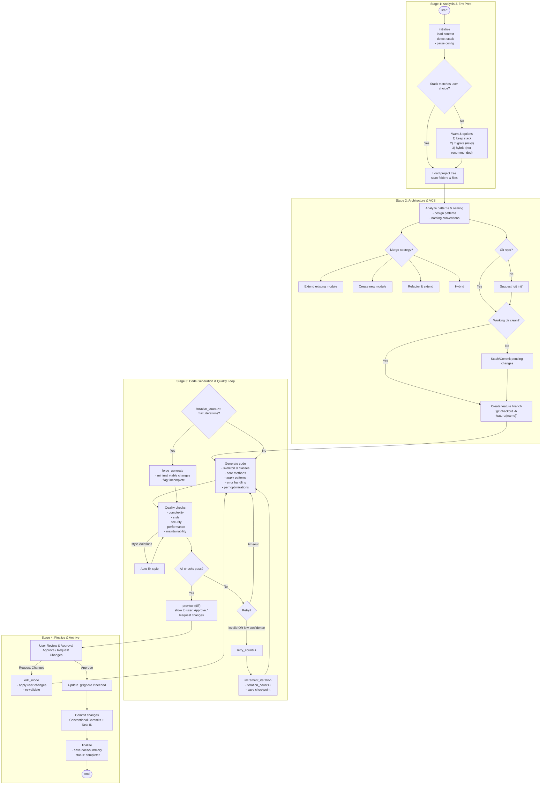

# Code Implementer - Flow Mô Tả Chi Tiết

## Tổng Quan
Code Implementer là sub-agent thứ 2 trong Developer Agent workflow, nhận implementation plan từ Task Analyzer và tạo ra production-ready code hoàn chỉnh để chuyển cho Test Generator.

---

## Flow Chi Tiết

### Tổng quan các giai đoạn

- Giai đoạn 1: Phân tích & Chuẩn bị Môi trường
- Giai đoạn 2: Hoạch định Kiến trúc & Quản lý phiên bản
- Giai đoạn 3: Vòng lặp Sinh mã & Đảm bảo Chất lượng
- Giai đoạn 4: Hoàn tất & Lưu trữ (kèm User Review & Approval trước khi commit)

---

### Giai đoạn 1: Phân tích & Chuẩn bị Môi trường

Mục tiêu: Hiểu bối cảnh dự án và chuẩn hóa môi trường làm việc trước khi thực hiện bất kỳ thay đổi nào.

1) Phân tích Tech Stack & Bối cảnh Dự án
   - Quét mã nguồn và tài liệu để nhận diện ngôn ngữ, framework, thư viện (VD: Django, FastAPI, React,...).
   - Thu thập metadata: phiên bản Python/Node/.NET, cấu hình build/test/lint, CI/CD hiện hữu.

2) Phát hiện Tech Stack hiện có (Auto-detect)
   - So khớp với lựa chọn/yêu cầu của người dùng.
   - Nhánh quyết định:
     - Match: tiếp tục với stack hiện có (khuyến nghị).
     - Mismatch: cảnh báo và đề xuất 3 lựa chọn:
       (1) Tiếp tục với stack hiện có (khuyến nghị).
       (2) Di chuyển sang stack mới (rủi ro).
       (3) Phương pháp Hybrid (không khuyến nghị).

3) Tải cấu trúc dự án hiện có
   - Nạp toàn bộ cấu trúc thư mục/file để định vị điểm mở rộng, module liên quan, và ràng buộc hiện có.

---

### Giai đoạn 2: Hoạch định Kiến trúc & Quản lý phiên bản

Mục tiêu: Lên chiến lược tích hợp và đảm bảo thay đổi được cô lập an toàn bằng Git.

1) Xác định Patterns & Quy ước Đặt tên
   - Identify Existing Patterns: các design patterns đang áp dụng (layered, repository, service, CQRS, v.v.).
   - Extract Naming Conventions: quy tắc đặt tên biến/hàm/class/module, cấu trúc import, layout thư mục.

2) Lựa chọn Chiến lược Tích hợp (Merge Strategy)
   - Extend Existing Module: khi tính năng liên quan chặt chẽ đến module hiện tại.
   - Create New Module: khi cần service/repository/micro-module mới.
   - Refactor & Extend: khi mã hiện tại có nợ kỹ thuật cần xử lý trước khi mở rộng.
   - Hybrid: kết hợp tùy bối cảnh phức tạp.

3) Chuẩn bị Git Repository
   - Phát hiện repo: `git status`; nếu chưa phải repo → đề xuất `git init`.
   - Kiểm tra working directory: `git status --porcelain`.
     - Nếu bẩn (dirty): đề xuất stash hoặc commit để về trạng thái sạch.
   - Tạo feature branch cô lập: `git checkout -b feature/{feature-name}` theo quy ước nhánh.

---

### Giai đoạn 3: Vòng lặp Sinh mã & Đảm bảo Chất lượng

Mục tiêu: Sinh mã theo kiến trúc đã chọn, kiểm soát chất lượng liên tục cho tới khi đạt chuẩn.

1) Generate Main Code
   - Setup Foundation & Class Structure: tạo file/thư mục, skeleton lớp/module.
   - Implement Core Methods: hiện thực logic cốt lõi, luồng I/O, adapter/boundary.
   - Apply Design Pattern: áp dụng patterns đã xác định ở Giai đoạn 2.
   - Handle Error Scenarios: bổ sung xử lý lỗi, ngoại lệ, phân loại lỗi; không bắt lỗi vô nghĩa.
   - Optimize Code Performance: tối ưu thuật toán/IO, tránh N+1, cải thiện độ phức tạp.

2) Quality Check & Output (Quality Gate)
   - Chỉ số kiểm tra:
     - Độ phức tạp (Code Complexity)
     - Vi phạm Style (Style Violations)
     - Điểm Bảo mật (Security Score)
     - Điểm Hiệu năng (Performance Score)
     - Vấn đề Bảo trì (Maintainability)
   - Vòng lặp cải tiến:
     - Nếu fail bất kỳ chỉ số → quay lại bước generate/sửa lỗi.
     - Style Violations: auto-fix, sau đó re-check.
   - Pass tất cả → chuyển sang giai đoạn cuối.

---

### Giai đoạn 4: Hoàn tất & Lưu trữ

Mục tiêu: Hoàn thiện thay đổi với quy trình minh bạch và lưu trữ an toàn.

0) User Review & Approval (trước khi commit)
   - Agent hiển thị diff thay đổi cho người dùng.
   - Người dùng lựa chọn:
     - Approve: đồng ý → tiến hành commit.
     - Request Changes: đưa góp ý → quay lại Giai đoạn 3 (Generate Main Code) với thông tin bổ sung.

1) Cập nhật `.gitignore` (nếu cần)
   - Bổ sung các file/thư mục mới phát sinh (build artifacts, cache, venv, lock,...).

2) Commit thay đổi
   - Commit toàn bộ thay đổi vào feature branch đã tạo.
   - Ghi rõ Task ID/Scope theo Conventional Commits.

3) Lưu trữ
   - Lưu tài liệu/biên bản thay đổi liên quan (nếu quy định) và chuẩn bị bàn giao cho Test Generator.

---

## Mermaid — Code Implementer Flow (detailed)

