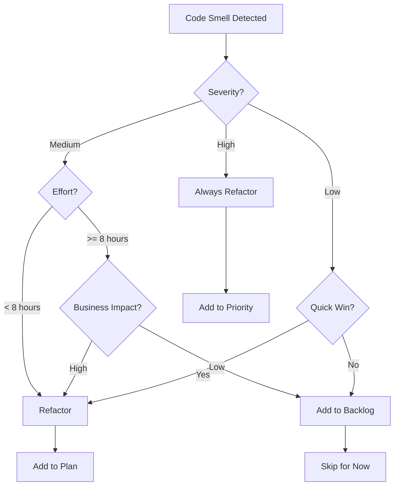

# Refactoring Agent - Flow Mô Tả Chi Tiết

## 📋 Tổng Quan

Refactoring Agent là sub-agent thứ 6 trong Developer Agent workflow, nhận code đã pass Quality Assurance và phân tích để tìm code smells, technical debt, đồng thời đề xuất các refactoring opportunities để cải thiện maintainability.

### **Vị trí trong Workflow:**
```
Quality Assurer (✅ Code quality passed)
    ↓
🔧 REFACTORING AGENT (Bước 6)
    ↓
Dependency Manager (Refactored code)
```

---

## 🎯 Input & Output

### **Input từ Quality Assurer:**
```python
{
    "code_files": {
        "payment_processor.py": "class PaymentProcessor: ...",
        "payment_repository.py": "class PaymentRepository: ...",
        "payment_validator.py": "class PaymentValidator: ..."
    },
    "quality_report": {
        "quality_score": 92,
        "linting_passed": True,
        "security_passed": True,
        "standards_compliant": True
    },
    "context": {
        "requirements": [...],
        "design_patterns_used": ["Repository", "Factory"],
        "performance_metrics": {...}
    }
}
```

### **Output cho Dependency Manager:**
```python
RefactoringResult(
    code_smells=[
        CodeSmell(
            smell_type="LONG_METHOD",
            severity="medium",
            file_path="payment_processor.py",
            line_start=45,
            line_end=110,
            description="Method 'process_payment' has 65 lines",
            suggested_refactoring="EXTRACT_METHOD",
            effort_estimate="small"
        )
    ],
    refactoring_plans=[...],
    technical_debt=[...],
    total_debt_hours=12.5,
    code_quality_score=78,
    maintainability_index=75,
    priority_refactorings=["Extract validation logic", "Remove duplicate code"],
    quick_wins=["Rename unclear variables", "Extract constants"],
    long_term_improvements=["Refactor to Strategy pattern"]
)
```

---

## 🔄 Flow Chi Tiết

### **🎯 Bước 1: Nhận và Phân Tích Code**

#### **1.1 Parse Code Structure**
```python
async def parse_code_structure(code: str, file_path: str) -> CodeStructure:
    """
    Phân tích cấu trúc code để chuẩn bị cho smell detection
    """
    
    # Parse AST (Abstract Syntax Tree)
    tree = ast.parse(code)
    
    # Extract structure
    structure = {
        "classes": [],
        "functions": [],
        "imports": [],
        "constants": [],
        "global_variables": []
    }
    
    for node in ast.walk(tree):
        if isinstance(node, ast.ClassDef):
            structure["classes"].append({
                "name": node.name,
                "line_start": node.lineno,
                "line_end": node.end_lineno,
                "methods": [m.name for m in node.body if isinstance(m, ast.FunctionDef)],
                "attributes": extract_attributes(node),
                "base_classes": [b.id for b in node.bases if isinstance(b, ast.Name)]
            })
        
        elif isinstance(node, ast.FunctionDef):
            structure["functions"].append({
                "name": node.name,
                "line_start": node.lineno,
                "line_end": node.end_lineno,
                "parameters": [arg.arg for arg in node.args.args],
                "complexity": calculate_complexity(node),
                "lines_of_code": node.end_lineno - node.lineno + 1
            })
    
    return CodeStructure(**structure)
```

#### **1.2 Calculate Initial Metrics**
```python
async def calculate_initial_metrics(code: str, structure: CodeStructure) -> dict:
    """
    Tính toán các metrics ban đầu
    """
    
    metrics = {
        "total_lines": len(code.split('\n')),
        "code_lines": count_code_lines(code),  # Exclude comments, blank lines
        "comment_lines": count_comment_lines(code),
        "blank_lines": count_blank_lines(code),
        
        # Class metrics
        "total_classes": len(structure.classes),
        "avg_class_size": avg([c.line_end - c.line_start for c in structure.classes]),
        "max_class_size": max([c.line_end - c.line_start for c in structure.classes]),
        
        # Method metrics
        "total_methods": len(structure.functions),
        "avg_method_size": avg([f.lines_of_code for f in structure.functions]),
        "max_method_size": max([f.lines_of_code for f in structure.functions]),
        "avg_parameters": avg([len(f.parameters) for f in structure.functions]),
        "max_parameters": max([len(f.parameters) for f in structure.functions]),
        
        # Complexity metrics
        "avg_complexity": avg([f.complexity for f in structure.functions]),
        "max_complexity": max([f.complexity for f in structure.functions]),
        
        # Comment ratio
        "comment_ratio": metrics["comment_lines"] / metrics["code_lines"]
    }
    
    return metrics
```

**Output Bước 1:**
```python
{
    "structure": CodeStructure(...),
    "metrics": {
        "total_lines": 450,
        "code_lines": 320,
        "avg_method_size": 18,
        "max_method_size": 65,  # ⚠️ Vượt threshold (50)
        "max_parameters": 7,     # ⚠️ Vượt threshold (5)
        "max_complexity": 15     # ⚠️ Vượt threshold (10)
    }
}
```

---

### **🔍 Bước 2: Detect Code Smells (12 Types)**

#### **2.1 Long Method Detection**
```python
async def detect_long_method(
    structure: CodeStructure,
    max_lines: int = 50
) -> List[CodeSmell]:
    """
    Phát hiện methods quá dài
    
    Threshold: max_method_lines = 50 (from config)
    """
    
    smells = []
    
    for function in structure.functions:
        if function.lines_of_code > max_lines:
            severity = "high" if function.lines_of_code > max_lines * 1.5 else "medium"
            
            smells.append(CodeSmell(
                smell_type=CodeSmellType.LONG_METHOD,
                severity=severity,
                file_path=structure.file_path,
                line_start=function.line_start,
                line_end=function.line_end,
                description=f"Method '{function.name}' has {function.lines_of_code} lines (max: {max_lines})",
                impact="Difficult to understand and maintain",
                suggested_refactoring=RefactoringType.EXTRACT_METHOD,
                effort_estimate="small" if function.lines_of_code < 80 else "medium"
            ))
    
    return smells
```

**Example - Long Method:**
```python
# ❌ SMELL: Long Method (65 lines)
async def process_payment(self, amount, card, user, options):
    """Process payment - TOO LONG!"""
    
    # Validation (15 lines)
    if amount <= 0:
        raise InvalidAmountError()
    if not card:
        raise InvalidCardError()
    # ... 13 more validation lines
    
    # Business logic (30 lines)
    if user.is_premium:
        discount = calculate_premium_discount(amount)
    else:
        discount = 0
    # ... 28 more business logic lines
    
    # External API calls (10 lines)
    stripe_result = await stripe.charge(amount, card)
    # ... 9 more API call lines
    
    # Logging and cleanup (10 lines)
    await log_transaction(stripe_result)
    # ... 9 more logging lines
    
    return result

# ✅ REFACTORED: Extract Method
async def process_payment(self, amount, card, user, options):
    """Process payment - CLEAN!"""
    await self._validate_payment(amount, card, user)
    final_amount = self._calculate_final_amount(amount, user)
    result = await self._execute_payment(final_amount, card)
    await self._log_transaction(result)
    return result

# Extracted methods (each < 20 lines)
async def _validate_payment(self, amount, card, user):
    """Validation logic"""
    # 15 lines

async def _calculate_final_amount(self, amount, user):
    """Business logic"""
    # 12 lines

async def _execute_payment(self, amount, card):
    """External API calls"""
    # 10 lines
```

#### **2.2 Large Class Detection**
```python
async def detect_large_class(
    structure: CodeStructure,
    max_lines: int = 300
) -> List[CodeSmell]:
    """
    Phát hiện classes quá lớn
    
    Threshold: max_class_lines = 300 (from config)
    """
    
    smells = []
    
    for cls in structure.classes:
        class_size = cls.line_end - cls.line_start + 1
        
        if class_size > max_lines:
            severity = "high" if class_size > max_lines * 1.5 else "medium"
            
            smells.append(CodeSmell(
                smell_type=CodeSmellType.LARGE_CLASS,
                severity=severity,
                file_path=structure.file_path,
                line_start=cls.line_start,
                line_end=cls.line_end,
                description=f"Class '{cls.name}' has {class_size} lines (max: {max_lines})",
                impact="Class has too many responsibilities",
                suggested_refactoring=RefactoringType.EXTRACT_CLASS,
                effort_estimate="large"
            ))
    
    return smells
```

**Example - Large Class:**
```python
# ❌ SMELL: Large Class (450 lines)
class PaymentProcessor:
    """Handles everything related to payments - TOO LARGE!"""
    
    # Payment processing (100 lines)
    async def process_payment(self, ...): pass
    async def refund_payment(self, ...): pass
    async def cancel_payment(self, ...): pass
    
    # Validation (80 lines)
    def validate_card(self, ...): pass
    def validate_amount(self, ...): pass
    def validate_user(self, ...): pass
    
    # External API integration (100 lines)
    async def call_stripe_api(self, ...): pass
    async def call_paypal_api(self, ...): pass
    
    # Database operations (80 lines)
    async def save_transaction(self, ...): pass
    async def get_transaction(self, ...): pass
    
    # Reporting (90 lines)
    async def generate_report(self, ...): pass
    async def send_receipt(self, ...): pass

# ✅ REFACTORED: Extract Classes
class PaymentProcessor:
    """Orchestrates payment processing - FOCUSED!"""
    def __init__(self):
        self.validator = PaymentValidator()
        self.gateway = PaymentGateway()
        self.repository = PaymentRepository()
        self.notifier = PaymentNotifier()
    
    async def process_payment(self, amount, card, user):
        self.validator.validate(amount, card, user)
        result = await self.gateway.charge(amount, card)
        await self.repository.save(result)
        await self.notifier.send_receipt(result)
        return result

class PaymentValidator:
    """Handles validation - 80 lines"""
    pass

class PaymentGateway:
    """Handles external APIs - 100 lines"""
    pass

class PaymentRepository:
    """Handles database - 80 lines"""
    pass

class PaymentNotifier:
    """Handles notifications - 90 lines"""
    pass
```

#### **2.3 Duplicate Code Detection**
```python
async def detect_duplicate_code(
    code: str,
    min_lines: int = 6
) -> List[CodeSmell]:
    """
    Phát hiện code bị duplicate
    
    Algorithm: Sử dụng token-based comparison
    """
    
    smells = []
    lines = code.split('\n')
    
    # Find duplicate blocks
    duplicates = find_duplicate_blocks(lines, min_lines)
    
    for dup in duplicates:
        smells.append(CodeSmell(
            smell_type=CodeSmellType.DUPLICATE_CODE,
            severity="medium",
            file_path=dup.file_path,
            line_start=dup.line_start,
            line_end=dup.line_end,
            description=f"Duplicate code block found (also at lines {dup.duplicate_at})",
            impact="Maintenance burden - changes need to be made in multiple places",
            suggested_refactoring=RefactoringType.EXTRACT_METHOD,
            effort_estimate="small"
        ))
    
    return smells
```

**Example - Duplicate Code:**
```python
# ❌ SMELL: Duplicate Code
class PaymentProcessor:
    async def process_credit_card(self, card):
        # Validation logic (duplicated)
        if not card.number:
            raise InvalidCardError("Card number required")
        if len(card.number) != 16:
            raise InvalidCardError("Invalid card number length")
        if not card.cvv:
            raise InvalidCardError("CVV required")
        if len(card.cvv) != 3:
            raise InvalidCardError("Invalid CVV length")
        # ... process credit card
    
    async def process_debit_card(self, card):
        # Same validation logic (duplicated) ❌
        if not card.number:
            raise InvalidCardError("Card number required")
        if len(card.number) != 16:
            raise InvalidCardError("Invalid card number length")
        if not card.cvv:
            raise InvalidCardError("CVV required")
        if len(card.cvv) != 3:
            raise InvalidCardError("Invalid CVV length")
        # ... process debit card

# ✅ REFACTORED: Extract Method
class PaymentProcessor:
    def _validate_card(self, card):
        """Extracted validation logic"""
        if not card.number:
            raise InvalidCardError("Card number required")
        if len(card.number) != 16:
            raise InvalidCardError("Invalid card number length")
        if not card.cvv:
            raise InvalidCardError("CVV required")
        if len(card.cvv) != 3:
            raise InvalidCardError("Invalid CVV length")
    
    async def process_credit_card(self, card):
        self._validate_card(card)  # ✅ Reuse
        # ... process credit card
    
    async def process_debit_card(self, card):
        self._validate_card(card)  # ✅ Reuse
        # ... process debit card
```

#### **2.4 Long Parameter List Detection**
```python
async def detect_long_parameter_list(
    structure: CodeStructure,
    max_params: int = 5
) -> List[CodeSmell]:
    """
    Phát hiện methods có quá nhiều parameters
    
    Threshold: max_parameters = 5 (from config)
    """
    
    smells = []
    
    for function in structure.functions:
        param_count = len(function.parameters)
        
        if param_count > max_params:
            severity = "high" if param_count > max_params * 1.5 else "medium"
            
            smells.append(CodeSmell(
                smell_type=CodeSmellType.LONG_PARAMETER_LIST,
                severity=severity,
                file_path=structure.file_path,
                line_start=function.line_start,
                line_end=function.line_end,
                description=f"Method '{function.name}' has {param_count} parameters (max: {max_params})",
                impact="Difficult to call and understand",
                suggested_refactoring=RefactoringType.INTRODUCE_PARAMETER_OBJECT,
                effort_estimate="small"
            ))
    
    return smells
```

**Example - Long Parameter List:**
```python
# ❌ SMELL: Long Parameter List (8 parameters)
async def process_payment(
    self,
    amount: float,
    currency: str,
    card_number: str,
    card_cvv: str,
    card_expiry: str,
    user_id: str,
    user_email: str,
    billing_address: str
):
    # ... implementation

# ✅ REFACTORED: Introduce Parameter Object
@dataclass
class PaymentRequest:
    """Parameter object"""
    amount: float
    currency: str
    card: CardInfo
    user: UserInfo
    billing_address: str

@dataclass
class CardInfo:
    number: str
    cvv: str
    expiry: str

@dataclass
class UserInfo:
    id: str
    email: str

async def process_payment(self, request: PaymentRequest):
    """Clean signature with 1 parameter"""
    # ... implementation
```

---

### **📊 Bước 3: Identify Technical Debt**

```python
async def identify_technical_debt(
    code: str,
    file_path: str,
    code_smells: List[CodeSmell]
) -> List[TechnicalDebt]:
    """
    Xác định technical debt từ code smells và các nguồn khác
    """
    
    debt_items = []
    
    # 3.1 Debt from code smells
    for smell in code_smells:
        debt_items.append(TechnicalDebt(
            debt_type="code_smell",
            severity=smell.severity,
            location=f"{smell.file_path}:{smell.line_start}-{smell.line_end}",
            description=smell.description,
            estimated_fix_time=estimate_fix_time(smell),
            business_impact=assess_business_impact(smell),
            recommended_action=f"Apply {smell.suggested_refactoring}"
        ))
    
    # 3.2 Debt from missing tests
    test_coverage = await analyze_test_coverage(code, file_path)
    if test_coverage < 80:
        debt_items.append(TechnicalDebt(
            debt_type="missing_tests",
            severity="high",
            location=file_path,
            description=f"Test coverage is {test_coverage}% (target: 80%)",
            estimated_fix_time=calculate_test_writing_time(code),
            business_impact="High risk of bugs in production",
            recommended_action="Write unit and integration tests"
        ))
    
    # 3.3 Debt from missing documentation
    doc_coverage = await analyze_documentation(code)
    if doc_coverage < 70:
        debt_items.append(TechnicalDebt(
            debt_type="missing_documentation",
            severity="medium",
            location=file_path,
            description=f"Documentation coverage is {doc_coverage}% (target: 70%)",
            estimated_fix_time=2.0,
            business_impact="Difficult for new developers to understand",
            recommended_action="Add docstrings to all public methods"
        ))
    
    return debt_items
```

**Output Bước 3:**
```python
[
    TechnicalDebt(
        debt_type="code_smell",
        severity="high",
        location="payment_processor.py:45-110",
        description="Method 'process_payment' has 65 lines",
        estimated_fix_time=2.0,  # hours
        business_impact="Difficult to maintain and extend",
        recommended_action="Apply EXTRACT_METHOD refactoring"
    ),
    TechnicalDebt(
        debt_type="missing_tests",
        severity="high",
        location="payment_processor.py",
        description="Test coverage is 45% (target: 80%)",
        estimated_fix_time=8.0,
        business_impact="High risk of bugs in production",
        recommended_action="Write unit and integration tests"
    )
]
```

---

### **�️ Bước 4: Generate Refactoring Plans**

```python
async def generate_refactoring_plans(
    code_smells: List[CodeSmell],
    code: str
) -> List[RefactoringPlan]:
    """
    Tạo refactoring plans chi tiết cho từng code smell
    """

    plans = []

    for smell in code_smells:
        plan = await create_refactoring_plan(smell, code)
        plans.append(plan)

    return plans

async def create_refactoring_plan(
    smell: CodeSmell,
    code: str
) -> RefactoringPlan:
    """
    Tạo plan cụ thể cho một code smell
    """

    # Extract target code
    target_code = extract_code_block(code, smell.line_start, smell.line_end)

    # Generate steps based on refactoring type
    if smell.suggested_refactoring == RefactoringType.EXTRACT_METHOD:
        steps = [
            "1. Identify logical blocks within the method",
            "2. Create new methods for each logical block",
            "3. Add appropriate parameters to new methods",
            "4. Replace original code with method calls",
            "5. Add docstrings to new methods",
            "6. Run tests to verify behavior unchanged"
        ]
        benefits = [
            "Improved readability",
            "Better testability",
            "Easier to maintain",
            "Reduced complexity"
        ]
        potential_issues = [
            "May need to pass many parameters",
            "Need to ensure no side effects"
        ]
        risk_level = "low"

    elif smell.suggested_refactoring == RefactoringType.EXTRACT_CLASS:
        steps = [
            "1. Identify related methods and attributes",
            "2. Create new class with appropriate name",
            "3. Move methods and attributes to new class",
            "4. Update original class to use new class",
            "5. Update all references",
            "6. Run tests to verify behavior unchanged"
        ]
        benefits = [
            "Better separation of concerns",
            "Improved cohesion",
            "Easier to understand and maintain"
        ]
        potential_issues = [
            "May introduce coupling between classes",
            "Need to update many references"
        ]
        risk_level = "medium"

    elif smell.suggested_refactoring == RefactoringType.INTRODUCE_PARAMETER_OBJECT:
        steps = [
            "1. Create new dataclass for parameters",
            "2. Group related parameters into dataclass",
            "3. Update method signature",
            "4. Update all method calls",
            "5. Add validation to dataclass",
            "6. Run tests to verify behavior unchanged"
        ]
        benefits = [
            "Cleaner method signature",
            "Easier to add new parameters",
            "Better parameter validation"
        ]
        potential_issues = [
            "Need to update all callers",
            "May need migration period"
        ]
        risk_level = "low"

    # Estimate effort
    effort_hours = estimate_refactoring_effort(smell, steps)

    return RefactoringPlan(
        refactoring_type=smell.suggested_refactoring,
        target_code=target_code,
        file_path=smell.file_path,
        description=f"Refactor {smell.smell_type} at lines {smell.line_start}-{smell.line_end}",
        steps=steps,
        estimated_effort_hours=effort_hours,
        risk_level=risk_level,
        benefits=benefits,
        potential_issues=potential_issues
    )
```

**Example Refactoring Plan:**
```python
RefactoringPlan(
    refactoring_type=RefactoringType.EXTRACT_METHOD,
    target_code="""
    async def process_payment(self, amount, card, user, options):
        # 65 lines of code
        ...
    """,
    file_path="payment_processor.py",
    description="Refactor LONG_METHOD at lines 45-110",
    steps=[
        "1. Identify logical blocks within the method",
        "2. Create new methods: _validate_payment, _execute_payment, _log_transaction",
        "3. Add appropriate parameters to new methods",
        "4. Replace original code with method calls",
        "5. Add docstrings to new methods",
        "6. Run tests to verify behavior unchanged"
    ],
    estimated_effort_hours=2.0,
    risk_level="low",
    benefits=[
        "Improved readability",
        "Better testability",
        "Easier to maintain",
        "Reduced complexity from 15 to 5"
    ],
    potential_issues=[
        "May need to pass payment context to new methods",
        "Need to ensure transaction atomicity"
    ]
)
```

---

### **📈 Bước 5: Calculate Maintainability Index**

```python
async def calculate_maintainability_index(code: str) -> float:
    """
    Tính Maintainability Index (MI)

    Formula:
    MI = 171 - 5.2 * ln(Halstead Volume)
         - 0.23 * (Cyclomatic Complexity)
         - 16.2 * ln(Lines of Code)

    MI Range:
    - 85-100: Highly maintainable (Green)
    - 65-85:  Moderately maintainable (Yellow)
    - 0-65:   Difficult to maintain (Red)
    """

    # 5.1 Calculate Halstead Metrics
    halstead = calculate_halstead_metrics(code)
    # halstead.volume = n1 * log2(n1) + n2 * log2(n2)
    # where n1 = unique operators, n2 = unique operands

    # 5.2 Calculate Cyclomatic Complexity
    complexity = calculate_cyclomatic_complexity(code)
    # complexity = edges - nodes + 2 * connected_components

    # 5.3 Count Lines of Code
    loc = count_lines_of_code(code)

    # 5.4 Calculate MI
    import math

    mi = (
        171
        - 5.2 * math.log(halstead.volume)
        - 0.23 * complexity
        - 16.2 * math.log(loc)
    )

    # Normalize to 0-100
    mi = max(0, min(100, mi))

    return mi
```

**Example Calculation:**
```python
# Code example
code = """
async def process_payment(self, amount, card, user):
    # 65 lines, complexity = 15
    ...
"""

# Metrics
halstead_volume = 450  # Calculated from operators/operands
cyclomatic_complexity = 15
lines_of_code = 65

# MI Calculation
mi = 171 - 5.2 * ln(450) - 0.23 * 15 - 16.2 * ln(65)
mi = 171 - 31.4 - 3.45 - 67.5
mi = 68.65  # Yellow zone (moderately maintainable)

# After refactoring
halstead_volume_after = 180  # Reduced
cyclomatic_complexity_after = 5  # Reduced
lines_of_code_after = 25  # Reduced

mi_after = 171 - 5.2 * ln(180) - 0.23 * 5 - 16.2 * ln(25)
mi_after = 171 - 27.1 - 1.15 - 52.1
mi_after = 90.65  # Green zone (highly maintainable) ✅
```

---

### **🎯 Bước 6: Prioritize Improvements**

```python
async def prioritize_improvements(
    code_smells: List[CodeSmell],
    refactoring_plans: List[RefactoringPlan],
    technical_debt: List[TechnicalDebt]
) -> dict:
    """
    Ưu tiên các improvements dựa trên impact, effort, và risk
    """

    # 6.1 Calculate Priority Score
    scored_plans = []
    for plan in refactoring_plans:
        score = calculate_priority_score(plan)
        scored_plans.append((plan, score))

    # Sort by score (descending)
    scored_plans.sort(key=lambda x: x[1], reverse=True)

    # 6.2 Categorize improvements
    quick_wins = []
    priority_refactorings = []
    long_term_improvements = []

    for plan, score in scored_plans:
        # Quick wins: Low effort, high impact, low risk
        if (plan.estimated_effort_hours <= 2.0
            and plan.risk_level == "low"
            and score > 70):
            quick_wins.append(plan.description)

        # Priority: High impact, medium effort
        elif score > 60:
            priority_refactorings.append(plan.description)

        # Long-term: High effort or high risk
        else:
            long_term_improvements.append(plan.description)

    return {
        "quick_wins": quick_wins,
        "priority_refactorings": priority_refactorings,
        "long_term_improvements": long_term_improvements
    }

def calculate_priority_score(plan: RefactoringPlan) -> float:
    """
    Calculate priority score (0-100)

    Factors:
    - Impact: 40%
    - Effort: 30% (inverse - lower effort = higher score)
    - Risk: 30% (inverse - lower risk = higher score)
    """

    # Impact score (based on benefits)
    impact_score = len(plan.benefits) * 20  # Max 100

    # Effort score (inverse)
    if plan.estimated_effort_hours <= 2:
        effort_score = 100
    elif plan.estimated_effort_hours <= 8:
        effort_score = 70
    else:
        effort_score = 40

    # Risk score (inverse)
    risk_scores = {"low": 100, "medium": 60, "high": 30}
    risk_score = risk_scores.get(plan.risk_level, 50)

    # Weighted average
    priority_score = (
        impact_score * 0.4 +
        effort_score * 0.3 +
        risk_score * 0.3
    )

    return min(100, priority_score)
```

**Example Prioritization:**
```python
# Plan 1: Extract Method (Long Method)
plan1_score = (
    80 * 0.4 +   # Impact: 4 benefits = 80
    100 * 0.3 +  # Effort: 2 hours = 100
    100 * 0.3    # Risk: low = 100
) = 92  # ⭐ Quick Win!

# Plan 2: Extract Class (Large Class)
plan2_score = (
    100 * 0.4 +  # Impact: 5 benefits = 100
    40 * 0.3 +   # Effort: 24 hours = 40
    60 * 0.3     # Risk: medium = 60
) = 70  # Priority Refactoring

# Plan 3: Replace Conditional with Polymorphism
plan3_score = (
    80 * 0.4 +   # Impact: 4 benefits = 80
    40 * 0.3 +   # Effort: 16 hours = 40
    30 * 0.3     # Risk: high = 30
) = 53  # Long-term Improvement

# Result
{
    "quick_wins": [
        "Extract validation logic from process_payment",
        "Rename unclear variable names",
        "Extract constants to config file"
    ],
    "priority_refactorings": [
        "Extract PaymentValidator class",
        "Remove duplicate validation code",
        "Introduce PaymentRequest parameter object"
    ],
    "long_term_improvements": [
        "Refactor payment processing to Strategy pattern",
        "Split PaymentProcessor into multiple classes",
        "Implement event-driven architecture"
    ]
}
```

---

### **✅ Bước 7: Quality Check & Output**

```python
async def quality_check_and_output(
    refactoring_result: RefactoringResult,
    config: RefactoringAgentConfig
) -> RefactoringResult:
    """
    Quality check trước khi output
    """

    # 7.1 Validate Maintainability Index
    if refactoring_result.maintainability_index < 65:
        raise QualityCheckFailed(
            f"Maintainability Index too low: {refactoring_result.maintainability_index} (min: 65)"
        )

    # 7.2 Check if critical debt is addressed
    critical_debt = [
        d for d in refactoring_result.technical_debt
        if d.severity == "critical"
    ]

    if critical_debt and not refactoring_result.priority_refactorings:
        raise QualityCheckFailed(
            f"Critical debt found but no priority refactorings planned"
        )

    # 7.3 Validate refactoring plans
    for plan in refactoring_result.refactoring_plans:
        if not plan.steps:
            raise QualityCheckFailed(
                f"Refactoring plan missing steps: {plan.description}"
            )

        if plan.estimated_effort_hours <= 0:
            raise QualityCheckFailed(
                f"Invalid effort estimate: {plan.estimated_effort_hours}"
            )

    # 7.4 Calculate final scores
    refactoring_result.code_quality_score = calculate_code_quality_score(
        refactoring_result
    )

    # ✅ All checks passed
    return refactoring_result

def calculate_code_quality_score(result: RefactoringResult) -> float:
    """
    Calculate overall code quality score (0-100)

    Factors:
    - Maintainability Index: 50%
    - Code Smells: 30% (inverse)
    - Technical Debt: 20% (inverse)
    """

    # MI score (already 0-100)
    mi_score = result.maintainability_index

    # Code smells score (inverse)
    smell_penalty = min(50, len(result.code_smells) * 5)
    smell_score = 100 - smell_penalty

    # Technical debt score (inverse)
    debt_penalty = min(50, result.total_debt_hours * 2)
    debt_score = 100 - debt_penalty

    # Weighted average
    quality_score = (
        mi_score * 0.5 +
        smell_score * 0.3 +
        debt_score * 0.2
    )

    return round(quality_score, 2)
```

**Output Example:**
```python
RefactoringResult(
    code_smells=[
        CodeSmell(smell_type="LONG_METHOD", severity="medium", ...),
        CodeSmell(smell_type="DUPLICATE_CODE", severity="low", ...)
    ],
    refactoring_plans=[
        RefactoringPlan(refactoring_type="EXTRACT_METHOD", ...),
        RefactoringPlan(refactoring_type="EXTRACT_METHOD", ...)
    ],
    technical_debt=[
        TechnicalDebt(debt_type="code_smell", severity="medium", ...),
        TechnicalDebt(debt_type="missing_tests", severity="high", ...)
    ],
    total_debt_hours=12.5,
    code_quality_score=78.5,
    maintainability_index=75.0,
    priority_refactorings=[
        "Extract PaymentValidator class",
        "Remove duplicate validation code"
    ],
    quick_wins=[
        "Extract validation logic from process_payment",
        "Rename unclear variable names"
    ],
    long_term_improvements=[
        "Refactor payment processing to Strategy pattern"
    ]
)
```

---

## 🔄 Feedback Loops

### **1. Low Maintainability Index Loop** 🔴

**Trigger:** MI < 65 (Red zone)

```
Bước 7: Quality Check
    ↓
❌ FAIL: MI = 58 (< 65)
    ↓
🔄 Action: RETRY_FROM_STEP_2
    ↓
Bước 2: Detect More Code Smells
    ↓
Bước 3: Identify Additional Debt
    ↓
Bước 4: Generate More Aggressive Plans
    ↓
Bước 5: Recalculate MI
    ↓
Bước 6: Re-prioritize
    ↓
Bước 7: Quality Check (RE-RUN)
    ↓
✅ PASS: MI = 72
```

**Max Retries:** 2 times
**Escalate to:** Code Implementer (nếu fail 2 lần)

---

### **2. Critical Debt Not Addressed Loop** 🟡

**Trigger:** Critical debt exists but no priority plans

```
Bước 7: Quality Check
    ↓
❌ FAIL: Critical debt found, no priority plans
    ↓
🔄 Action: RETRY_FROM_STEP_4
    ↓
Bước 4: Generate Plans for Critical Debt
    ↓
Bước 6: Re-prioritize (ensure critical debt in priority)
    ↓
Bước 7: Quality Check (RE-RUN)
    ↓
✅ PASS: Critical debt addressed
```

**Max Retries:** 1 time
**Escalate to:** Code Reviewer (nếu fail)

---

### **3. Too Many Code Smells Loop** 🟠

**Trigger:** > 10 code smells detected

```
Bước 2: Detect Code Smells
    ↓
⚠️ WARNING: 15 code smells found
    ↓
Decision: Should we refactor or escalate?
    ↓
IF total_debt_hours > 40:
    🚨 ESCALATE to Code Implementer
    (Code needs major restructuring)
ELSE:
    ✅ CONTINUE with refactoring plans
```

---

## 📊 Decision Trees

### **Decision Tree 1: Refactor vs Skip**



### **Decision Tree 2: Priority Matrix**

```
                    High Impact
                        ↑
                        |
        Quick Wins      |    Priority
        (Do First)      |    (Do Next)
                        |
    ←───────────────────┼───────────────────→
        Low Effort      |    High Effort
                        |
        Nice to Have    |    Long-term
        (Backlog)       |    (Plan)
                        |
                        ↓
                    Low Impact
```

**Mapping:**
- **Quick Wins**: High Impact + Low Effort + Low Risk
- **Priority**: High Impact + Medium Effort
- **Long-term**: High Impact + High Effort OR High Risk
- **Backlog**: Low Impact

---

## ⏱️ Effort Estimation

### **Estimation Formula:**

```python
def estimate_refactoring_effort(
    smell: CodeSmell,
    steps: List[str]
) -> float:
    """
    Estimate effort in hours

    Base effort by smell type:
    - LONG_METHOD: 2 hours
    - LARGE_CLASS: 24 hours
    - DUPLICATE_CODE: 1 hour
    - LONG_PARAMETER_LIST: 2 hours
    - FEATURE_ENVY: 4 hours
    - DATA_CLUMPS: 3 hours
    - PRIMITIVE_OBSESSION: 6 hours
    - SWITCH_STATEMENTS: 8 hours
    - LAZY_CLASS: 1 hour
    - SPECULATIVE_GENERALITY: 2 hours
    - DEAD_CODE: 0.5 hours
    - EXCESSIVE_COMMENTS: 1 hour

    Multipliers:
    - Severity high: x1.5
    - Severity medium: x1.0
    - Severity low: x0.7

    - Lines affected > 100: x1.3
    - Lines affected > 50: x1.1

    - Risk high: x1.4
    - Risk medium: x1.2
    - Risk low: x1.0
    """

    # Base effort
    base_efforts = {
        CodeSmellType.LONG_METHOD: 2.0,
        CodeSmellType.LARGE_CLASS: 24.0,
        CodeSmellType.DUPLICATE_CODE: 1.0,
        CodeSmellType.LONG_PARAMETER_LIST: 2.0,
        # ... etc
    }

    base = base_efforts.get(smell.smell_type, 4.0)

    # Severity multiplier
    severity_multipliers = {"high": 1.5, "medium": 1.0, "low": 0.7}
    severity_mult = severity_multipliers.get(smell.severity, 1.0)

    # Size multiplier
    lines_affected = smell.line_end - smell.line_start + 1
    if lines_affected > 100:
        size_mult = 1.3
    elif lines_affected > 50:
        size_mult = 1.1
    else:
        size_mult = 1.0

    # Calculate
    effort = base * severity_mult * size_mult

    # Round to nearest 0.5
    return round(effort * 2) / 2
```

**Examples:**
```python
# Example 1: Long Method (65 lines, medium severity)
effort = 2.0 * 1.0 * 1.1 = 2.2 hours → 2.0 hours (small)

# Example 2: Large Class (450 lines, high severity)
effort = 24.0 * 1.5 * 1.3 = 46.8 hours → 47.0 hours (large)

# Example 3: Duplicate Code (10 lines, low severity)
effort = 1.0 * 0.7 * 1.0 = 0.7 hours → 0.5 hours (small)
```

---

## 📈 Metrics & Thresholds

### **Configuration Thresholds:**

```python
RefactoringAgentConfig(
    # Detection settings
    smell_detection_enabled=True,
    debt_tracking_enabled=True,
    auto_refactor=False,

    # Thresholds
    max_method_lines=50,        # Long Method threshold
    max_class_lines=300,        # Large Class threshold
    max_parameters=5,           # Long Parameter List threshold
    max_complexity=10,          # Cyclomatic Complexity threshold

    # Priorities
    prioritize_security_debt=True,
    prioritize_performance_debt=True,

    # Effort estimation
    small_effort_hours=2.0,     # Quick wins
    medium_effort_hours=8.0,    # Priority refactorings
    large_effort_hours=24.0     # Long-term improvements
)
```

### **Quality Metrics:**

| Metric | Green | Yellow | Red |
|--------|-------|--------|-----|
| **Maintainability Index** | 85-100 | 65-85 | 0-65 |
| **Code Quality Score** | 80-100 | 60-80 | 0-60 |
| **Code Smells** | 0-3 | 4-10 | 11+ |
| **Technical Debt (hours)** | 0-10 | 11-40 | 41+ |
| **Cyclomatic Complexity** | 1-10 | 11-20 | 21+ |
| **Method Lines** | 1-50 | 51-80 | 81+ |
| **Class Lines** | 1-300 | 301-500 | 501+ |

---

## 🎯 Complete Workflow Summary

```
START: Receive code from Quality Assurer
    ↓
Bước 1: Parse & Analyze Code Structure
    ├─ Parse AST
    ├─ Extract classes, methods, functions
    └─ Calculate initial metrics
    ↓
Bước 2: Detect Code Smells (12 types)
    ├─ Long Method (> 50 lines)
    ├─ Large Class (> 300 lines)
    ├─ Duplicate Code
    ├─ Long Parameter List (> 5 params)
    ├─ Feature Envy
    ├─ Data Clumps
    ├─ Primitive Obsession
    ├─ Switch Statements
    ├─ Lazy Class
    ├─ Speculative Generality
    ├─ Dead Code
    └─ Excessive Comments
    ↓
Bước 3: Identify Technical Debt
    ├─ Debt from code smells
    ├─ Debt from missing tests
    └─ Debt from missing documentation
    ↓
Bước 4: Generate Refactoring Plans
    ├─ Create plan for each smell
    ├─ Define steps
    ├─ Estimate effort
    ├─ Assess risk
    └─ List benefits & issues
    ↓
Bước 5: Calculate Maintainability Index
    ├─ Halstead Volume
    ├─ Cyclomatic Complexity
    ├─ Lines of Code
    └─ MI = 171 - 5.2*ln(HV) - 0.23*CC - 16.2*ln(LOC)
    ↓
Bước 6: Prioritize Improvements
    ├─ Calculate priority scores
    ├─ Categorize: Quick Wins
    ├─ Categorize: Priority Refactorings
    └─ Categorize: Long-term Improvements
    ↓
Bước 7: Quality Check & Output
    ├─ Validate MI >= 65
    ├─ Check critical debt addressed
    ├─ Validate refactoring plans
    └─ Calculate code quality score
    ↓
    [Quality Check]
    ├─ PASS → Output to Dependency Manager ✅
    └─ FAIL → Retry from appropriate step 🔄
```

---

## 💡 Best Practices

### **✅ DO:**
- Always detect all 12 code smell types
- Prioritize based on impact, effort, and risk
- Provide detailed refactoring steps
- Calculate accurate effort estimates
- Track technical debt over time
- Focus on quick wins first
- Document all refactoring decisions

### **❌ DON'T:**
- Don't refactor without clear benefits
- Don't ignore high-severity smells
- Don't create plans without steps
- Don't underestimate effort
- Don't refactor without tests
- Don't skip maintainability calculation
- Don't ignore business impact

---

## 📚 References

- **Refactoring Catalog**: https://refactoring.guru/refactoring/catalog
- **Code Smells**: https://refactoring.guru/refactoring/smells
- **Maintainability Index**: https://docs.microsoft.com/en-us/visualstudio/code-quality/code-metrics-values
- **Cyclomatic Complexity**: https://en.wikipedia.org/wiki/Cyclomatic_complexity
- **Halstead Metrics**: https://en.wikipedia.org/wiki/Halstead_complexity_measures

---

**Last Updated:** 2025-01-15
**Status:** 📝 Documentation Complete
