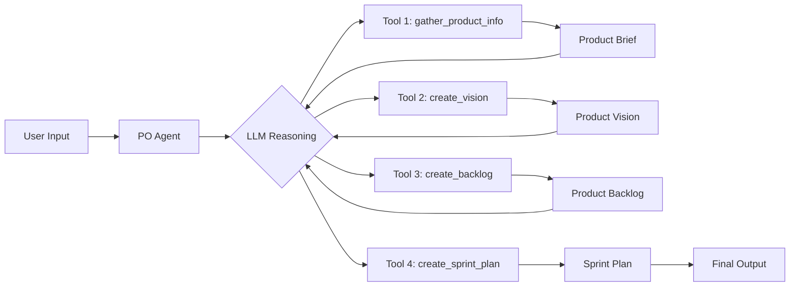

# Product Owner (PO) Agent

## Overview

**PO Agent** là orchestrator chính cho toàn bộ workflow Product Owner, sử dụng **Deep Agent pattern** từ **`deepagents` library** (https://github.com/langchain-ai/deepagents) để tự động điều phối 4 sub agents:

1. **Gatherer Agent** - Thu thập Product Brief
2. **Vision Agent** - Tạo Product Vision & PRD
3. **Backlog Agent** - Tạo Product Backlog
4. **Priority Agent** - Tạo Sprint Plan

**Note:** PO Agent gọi các sub agents như tools và pass data trực tiếp qua return values (không sử dụng file system).

## Architecture

### Deep Agent Pattern (from `deepagents` library)

```
┌──────────────────────────────────────────────────────────┐
│            PO Agent (Deep Agent)                         │
│  - LLM reasoning: Tự quyết định gọi tool nào             │
│  - Tool chaining: Pass data trực tiếp giữa tools         │
│  - ReAct loop: Observe → Think → Act                     │
│  - State persistence: MemorySaver checkpointer           │
└───────────────────┬──────────────────────────────────────┘
                    │
                    │ (gọi tools tuần tự)
      ┌─────────────┼─────────────┼─────────────┐
      │             │             │             │
      ↓             ↓             ↓             ↓
  ┌────────┐  ┌─────────┐  ┌──────────┐    ┌──────────┐
  │Tool 1  │  │ Tool 2  │  │  Tool 3  │    │  Tool 4  │
  │Gatherer│  │ Vision  │  │  Backlog │    │ Priority │
  └────┬───┘  └────┬────┘  └─────┬────┘    └─────┬────┘
       │           │             │               │
       │ (dict)    │ (dict)      │ (dict)        │ (dict)
       └───────────┴─────────────┴───────────────┘
                Data flow: return values
```

### Workflow



## Key Features

### 1. **LLM Reasoning & Tool Chaining**
- LLM tự quyết định gọi tool nào, khi nào
- Không cần supervisor node riêng
- Tools được gọi tuần tự: gather → vision → backlog → sprint_plan
- Data pass trực tiếp qua return values (dict)

### 2. **Sub-agents as Tools**
- 4 sub-agents được wrap thành tools
- Mỗi tool là một complete workflow (LangGraph)
- Human-in-the-loop được handle **bên trong mỗi sub agent**
- PO Agent chỉ orchestrate, không can thiệp vào sub agent logic

### 3. **State Persistence**
- MemorySaver checkpointer lưu state giữa các lần chạy
- Có thể resume workflow với thread_id
- Message history được persist

### 4. **Langfuse Tracking**
- Track toàn bộ tool calls và LLM reasoning
- Traces theo session_id và user_id
- Monitor performance và quality

### 5. **Streaming Execution**
- Stream từng step để observe real-time
- Verbose logging cho debugging
- Clear separation giữa các steps

## Usage

### Basic Usage

```python
from agents.product_owner.po_agent import POAgent

# Initialize PO Agent
po_agent = POAgent(
    session_id="unique_session_id",
    user_id="user_123"
)

# Run workflow
user_input = """
Tôi muốn tạo một ứng dụng quản lý công việc...
"""

result = po_agent.run(user_input=user_input)

# Result structure
{
    "messages": [
        {"type": "human", "content": "..."},
        {"type": "ai", "content": "..."},
        {"type": "tool", "content": "..."},
        ...
    ]
}
```

### With Thread ID (Resume)

```python
# First run
result1 = po_agent.run(
    user_input=user_input,
    thread_id="thread_abc"
)

# Resume later (same thread)
result2 = po_agent.run(
    user_input="continue",
    thread_id="thread_abc"  # Resume từ state cũ
)
```

## Tools

### 1. `gather_product_info(user_input: str) -> dict`

**Purpose**: Thu thập Product Brief từ user

**Input**:
- `user_input`: Mô tả ý tưởng sản phẩm

**Output**:
```python
{
    "product_name": "TaskMaster Pro",
    "description": "...",
    "target_audience": ["...", "..."],
    "key_features": ["...", "..."],
    "benefits": ["...", "..."],
    "competitors": ["...", "..."],
    "completeness_note": "..."
}
```

**Human-in-the-Loop**: ✅ (GathererAgent preview)

---

### 2. `create_vision(product_brief: dict) -> dict`

**Purpose**: Tạo Product Vision và PRD

**Input**:
- `product_brief`: Product Brief từ tool 1

**Output**:
```python
{
    "product_name": "TaskMaster Pro",
    "vision_statement_final": "...",
    "experience_principles": ["...", "..."],
    "problem_summary": "...",
    "audience_segments": [...],
    "scope_capabilities": ["...", "..."],
    "scope_non_goals": ["...", "..."],
    "functional_requirements": [
        {
            "name": "...",
            "description": "...",
            "priority": "High",
            "user_stories": ["...", "..."],
            "acceptance_criteria": ["...", "..."]
        }
    ],
    "performance_requirements": ["...", "..."],
    "security_requirements": ["...", "..."],
    "ux_requirements": ["...", "..."],
    "dependencies": ["...", "..."],
    "risks": ["...", "..."],
    "assumptions": ["...", "..."]
}
```

**Human-in-the-Loop**: ✅ (VisionAgent preview)

---

### 3. `create_backlog(product_vision: dict) -> dict`

**Purpose**: Tạo Product Backlog

**Input**:
- `product_vision`: Product Vision từ tool 2

**Output**:
```python
{
    "metadata": {
        "product_name": "TaskMaster Pro",
        "version": "v1.0",
        "total_items": 37,
        "total_epics": 5,
        "total_user_stories": 26,
        "total_tasks": 2,
        "total_subtasks": 4,
        "total_story_points": 92,
        "total_estimate_hours": 26.0
    },
    "items": [
        {
            "id": "EPIC-001",
            "type": "Epic",
            "parent_id": null,
            "title": "...",
            "description": "...",
            "acceptance_criteria": [],
            "dependencies": [],
            "labels": ["...", "..."],
            "business_value": "..."
        },
        {
            "id": "US-001",
            "type": "User Story",
            "parent_id": "EPIC-001",
            "title": "As a..., I want..., so that...",
            "description": "...",
            "story_point": 3,
            "acceptance_criteria": [
                "Given..., When..., Then..."
            ],
            "dependencies": []
        },
        ...
    ]
}
```

**Human-in-the-Loop**: ✅ (BacklogAgent preview)

---

### 4. `create_sprint_plan(product_backlog: dict) -> dict`

**Purpose**: Tạo Sprint Plan với WSJF prioritization

**Input**:
- `product_backlog`: Product Backlog từ tool 3

**Output**:
```python
{
    "metadata": {
        "product_name": "TaskMaster Pro",
        "version": "v1.0",
        "total_sprints": 3,
        "total_items_assigned": 28,
        "total_story_points": 75,
        "sprint_duration_weeks": 2,
        "sprint_capacity_story_points": 30,
        "readiness_score": 0.85,
        "status": "finalized"
    },
    "prioritized_backlog": [
        {
            "id": "US-001",
            "rank": 1,
            "wsjf_score": 2.5,
            "title": "...",
            ...
        }
    ],
    "wsjf_calculations": {
        "US-001": {
            "business_value": 8,
            "time_criticality": 7,
            "risk_reduction": 5,
            "job_size": 8,
            "wsjf_score": 2.5,
            "reasoning": "..."
        }
    },
    "sprints": [
        {
            "sprint_id": "sprint-1",
            "sprint_number": 1,
            "sprint_goal": "...",
            "start_date": "2025-01-15",
            "end_date": "2025-01-29",
            "velocity_plan": 28,
            "assigned_items": ["US-001", "US-002", ...]
        }
    ],
    "unassigned_items": []
}
```

**Human-in-the-Loop**: ✅ (PriorityAgent preview)

## System Prompt

PO Agent sử dụng system prompt chi tiết để hướng dẫn LLM:

- **Workflow**: 4 bước tuần tự (gather → vision → backlog → priority)
- **Tool usage**: Khi nào gọi tool nào
- **Error handling**: Xử lý lỗi từ tools
- **Output format**: Không duplicate thông tin đã print

Xem chi tiết tại: `po_agent.py:_get_system_prompt()`

## Configuration

### Environment Variables

```bash
# LLM Configuration
OPENAI_API_KEY=your_api_key
OPENAI_BASE_URL=https://api.openai.com/v1

# Langfuse Tracking
LANGFUSE_PUBLIC_KEY=your_public_key
LANGFUSE_SECRET_KEY=your_secret_key
LANGFUSE_HOST=https://cloud.langfuse.com
```

### Agent Parameters

```python
POAgent(
    session_id: str | None = None,  # Session ID cho tracking
    user_id: str | None = None       # User ID cho tracking
)
```

### Run Parameters

```python
po_agent.run(
    user_input: str,              # Ý tưởng sản phẩm
    thread_id: str | None = None  # Thread ID để resume
)
```

## Testing

### Test PO Agent

```bash
# Run main.py và chọn option 1
python app/main.py

# Hoặc test trực tiếp
python app/agents/product_owner/po_agent.py
```

### Test Flow

```
1. User input: "Tôi muốn tạo một ứng dụng..."
2. PO Agent: Gọi gather_product_info tool
3. GathererAgent: Thu thập thông tin, preview, approve
4. PO Agent: Nhận Product Brief, reasoning
5. PO Agent: Gọi create_vision tool
6. VisionAgent: Tạo vision, preview, approve
7. PO Agent: Nhận Product Vision, reasoning
8. PO Agent: Gọi create_backlog tool
9. BacklogAgent: Tạo backlog, preview, approve
10. PO Agent: Nhận Product Backlog, reasoning
11. PO Agent: Gọi create_sprint_plan tool
12. PriorityAgent: Tạo sprint plan, preview, approve
13. PO Agent: Nhận Sprint Plan, kết thúc workflow
```

## Monitoring

### Langfuse Tracking

Mọi tool call và LLM reasoning đều được track qua Langfuse:

- **Session ID**: Theo dõi một workflow hoàn chỉnh
- **User ID**: Theo dõi theo user
- **Traces**: Chi tiết từng tool call
- **Generations**: LLM reasoning steps
- **Scores**: Đánh giá quality

### Check Traces

```
https://cloud.langfuse.com/project/<your_project>/traces
```

Filter by `session_id` để xem chi tiết một workflow.

## Advantages

### So với Supervisor Pattern

| Feature | Supervisor Pattern | Deep Agent (PO Agent) |
|---------|-------------------|-----------------------|
| Complexity | High (supervisor node + routing) | Low (LLM tự routing) |
| Flexibility | Medium | High (LLM adaptive) |
| Token Usage | Higher (supervisor calls) | Lower (direct tool calls) |
| Error Handling | Manual routing logic | LLM reasoning |
| Maintenance | More code to maintain | Less boilerplate |

### So với Sequential Pipeline

| Feature | Sequential Pipeline | Deep Agent (PO Agent) |
|---------|---------------------|----------------------|
| Intelligence | None (hardcoded) | LLM reasoning |
| Adaptability | Fixed flow | Dynamic flow |
| Error Recovery | Manual | LLM-driven retry |
| Skip Steps | Not possible | LLM can decide |

## Troubleshooting

### Tool Call Failures

**Symptom**: Tool gọi thất bại, error message xuất hiện

**Solution**:
1. Check error message từ sub agent
2. LLM sẽ reasoning về error
3. LLM có thể retry hoặc skip

### LLM Không Gọi Tool

**Symptom**: LLM trả lời trực tiếp thay vì gọi tool

**Solution**:
1. Kiểm tra system prompt
2. Ensure tool docstrings rõ ràng
3. Tăng temperature nếu LLM quá conservative

### State Loss

**Symptom**: Workflow không resume được

**Solution**:
1. Ensure `thread_id` giống nhau
2. Check MemorySaver có được init
3. Verify checkpointer config

## Future Enhancements

### 1. **Parallel Tool Execution**
- Gọi multiple tools cùng lúc (khi không có dependencies)
- Ví dụ: Vision + Backlog analysis song song

### 2. **Tool Result Caching**
- Cache tool outputs để tránh re-run khi retry
- Reduce latency và cost

### 3. **Streaming Output**
- Stream tool outputs real-time cho frontend
- Better UX với progress updates

### 4. **Multi-Model Support**
- Support nhiều LLM providers (Anthropic, OpenAI, etc.)
- Fallback strategy khi một model fail

## References

- [LangGraph Documentation](https://langchain-ai.github.io/langgraph/)
- [ReAct Agent Pattern](https://langchain-ai.github.io/langgraph/tutorials/rag/langgraph_agentic_rag/)
- [Tool Calling Best Practices](https://python.langchain.com/docs/modules/agents/tools/)
- [Langfuse Tracing](https://langfuse.com/docs/tracing)

## Contributors

- Product Owner Agent Team
- VibeSDLC AI Agent Service

## License

Internal use only - VibeSDLC Project
